# Domain State Event Logging: A Multi-Resolution Event Store Pattern for Platform Engineering

**Author**: Trevor Samaroo

**Abstract**

This paper presents Domain State Event Logging (DSEL), a pragmatic synthesis of Event Sourcing, CQRS, and Domain-Driven Design, optimized for platform engineering contexts where operational simplicity and developer experience matter more than storage optimization. Unlike traditional Event Sourcing which stores deltas and requires complex replay logic, or CQRS which maintains separate read/write models, DSEL stores complete domain object state snapshots within event envelopes—trading storage cost for operational simplicity. The pattern pairs naturally with declarative APIs (Kubernetes-style manifests) for platform engineering use cases. This approach emerged from building multiple mission-critical production platforms serving thousands of users globally, with proven implementations on both MongoDB and DynamoDB. The pattern includes multi-resolution event streams (fine-grained domain events and coarse-grained aggregates), multi-tier read architecture with graceful fallback mechanisms, and support for global distribution via datastores like DynamoDB Global Tables, Cassandra, or Spanner. We demonstrate how this battle-tested pattern enables schema evolution, temporal queries, audit trails, and efficient analytics while maintaining query stability—making it particularly valuable for platform engineering teams building Kubernetes-style internal developer platforms.

---

## Table of Contents

1. [Introduction](#introduction)
2. [Problem Space](#problem-space)
3. [Pattern Overview](#pattern-overview)
4. [Core Architecture](#core-architecture)
5. [Event Model](#event-model)
6. [Multi-Resolution Event Streams](#multi-resolution-event-streams)
7. [Storage Implementation](#storage-implementation)
8. [Comparison with Existing Patterns](#comparison-with-existing-patterns)
9. [Benefits and Tradeoffs](#benefits-and-tradeoffs)
10. [Implementation Patterns](#implementation-patterns)
11. [Global Distribution and Multi-Region Consistency](#global-distribution-and-multi-region-consistency)
12. [Real-World Applications](#real-world-applications)
13. [Conclusion](#conclusion)

---

## 1. Introduction

Modern platform engineering demands systems that are:
- **Evolvable**: New domain objects can be added without breaking existing functionality
- **Observable**: Complete audit trails of user intent and system state changes
- **Analyzable**: Historical data accessible for analytics and compliance
- **Declarative**: Users express desired state, not imperative procedures

Traditional persistence patterns—CRUD databases, Event Sourcing, and CQRS—each address some of these requirements but fall short in specific ways for platform engineering contexts. This paper introduces Domain State Event Logging (DSEL), a pattern that emerged from building multiple production developer platforms, which combines the strengths of these approaches while addressing their limitations. DSEL has been successfully deployed in multiple mission-critical production systems serving thousands of users globally, with proven implementations using both MongoDB and DynamoDB as backing datastores.

### Key Contributions

1. **Request-Response Event Pairs**: Capturing both user intent and system response as separate events when they contain distinct information
2. **Full-State Event Envelopes**: Embedding complete domain object state within events, eliminating replay complexity
3. **Multi-Resolution Event Streams**: Maintaining both fine-grained domain events and coarse-grained aggregate meta-streams
4. **Multi-Tier Read Architecture**: Leveraging DAX, DynamoDB, and OpenSearch for optimal latency at each query tier with graceful fallback
5. **Global Distribution**: DynamoDB Global Tables or Cassandra enable globally consistent platform state with regional OpenSearch clusters
6. **Declarative Event Semantics**: Kubernetes-inspired API patterns applied to event-driven persistence
7. **Query-Stable Schema Evolution**: New domain types added without impacting existing queries

---

## 2. Problem Space

### 2.1 The Platform Engineering Challenge

Developer platforms expose domain abstractions (APIs, CLIs, manifests) for developers to self-serve infrastructure and application management. Consider platforms like:
- **Kubernetes**: Declarative manifests for container orchestration
- **Terraform**: Infrastructure as code
- **Internal Developer Platforms (IDPs)**: Custom abstractions for deployment, artifacts, configurations

These platforms share common requirements:

#### Requirement 1: Evolvability
Platforms must add new domain objects (e.g., new Kubernetes Custom Resource Definitions) without:
- Migrating existing data schemas
- Breaking existing queries or APIs
- Requiring downtime

#### Requirement 2: Temporal Awareness
Platforms need to answer questions like:
- What was the state of this deployment yesterday?
- When did this configuration change?
- What was the user's original intent vs. what was actually applied?

#### Requirement 3: Audit and Compliance
Organizations require:
- Complete history of who changed what, when
- Distinction between attempted changes and successful changes
- Immutable audit logs

#### Requirement 4: Analytics and Observability
Platform teams need to:
- Stream changes to analytics systems (OpenSearch, data lakes)
- Generate reports on platform usage
- Debug production issues by reviewing historical state

### 2.2 Limitations of Traditional Approaches

#### CRUD (Create, Read, Update, Delete)
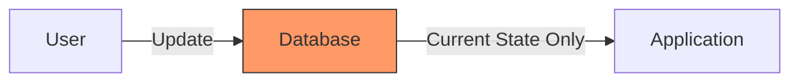
```mermaid
graph LR
    A[User] -->|Update| B[Database]
    B -->|Current State Only| C[Application]

    style B fill:#f96,stroke:#333
```

**Limitations:**
- ❌ No temporal history (updates overwrite previous state)
- ❌ No distinction between intent and outcome
- ❌ Schema evolution requires migrations
- ❌ No audit trail without additional systems

#### Event Sourcing
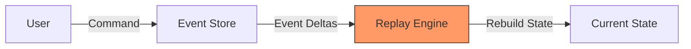
```mermaid
graph LR
    A[User] -->|Command| B[Event Store]
    B -->|Event Deltas| C[Replay Engine]
    C -->|Rebuild State| D[Current State]

    style C fill:#f96,stroke:#333
```

**Limitations:**
- ❌ State reconstruction requires replaying all events (performance cost)
- ❌ Query complexity increases with event history length
- ❌ Schema evolution of old events is complex
- ❌ Difficult to query historical state directly

#### CQRS (Command Query Responsibility Segregation)
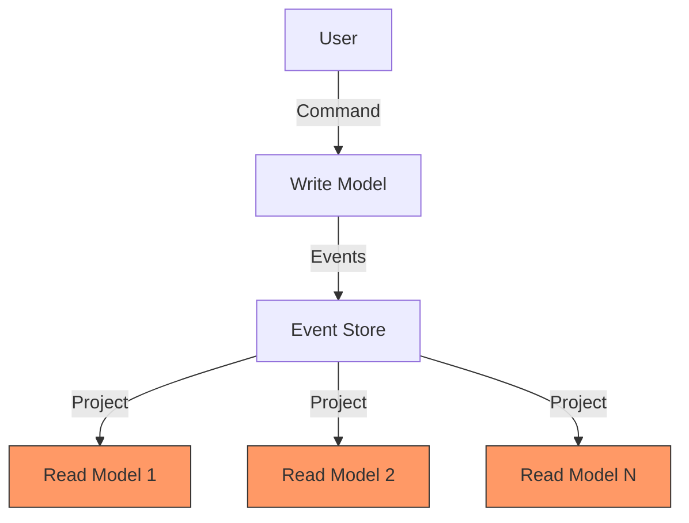
```mermaid
graph TB
    A[User] -->|Command| B[Write Model]
    B -->|Events| C[Event Store]
    C -->|Project| D[Read Model 1]
    C -->|Project| E[Read Model 2]
    C -->|Project| F[Read Model N]

    style D fill:#f96,stroke:#333
    style E fill:#f96,stroke:#333
    style F fill:#f96,stroke:#333
```

**Limitations:**
- ❌ Read model synchronization complexity
- ❌ Multiple projections to maintain
- ❌ Eventual consistency challenges
- ❌ Still requires event replay for new read models

---

## 3. Pattern Overview

### 3.1 Core Concept

Domain State Event Logging (DSEL) stores **complete domain object state** within **event envelopes** that represent **declarative user intents** and **system responses**. Events are stored in a **single, append-only log** with **multi-dimensional indexing** for efficient queries.

### 3.2 High-Level Architecture

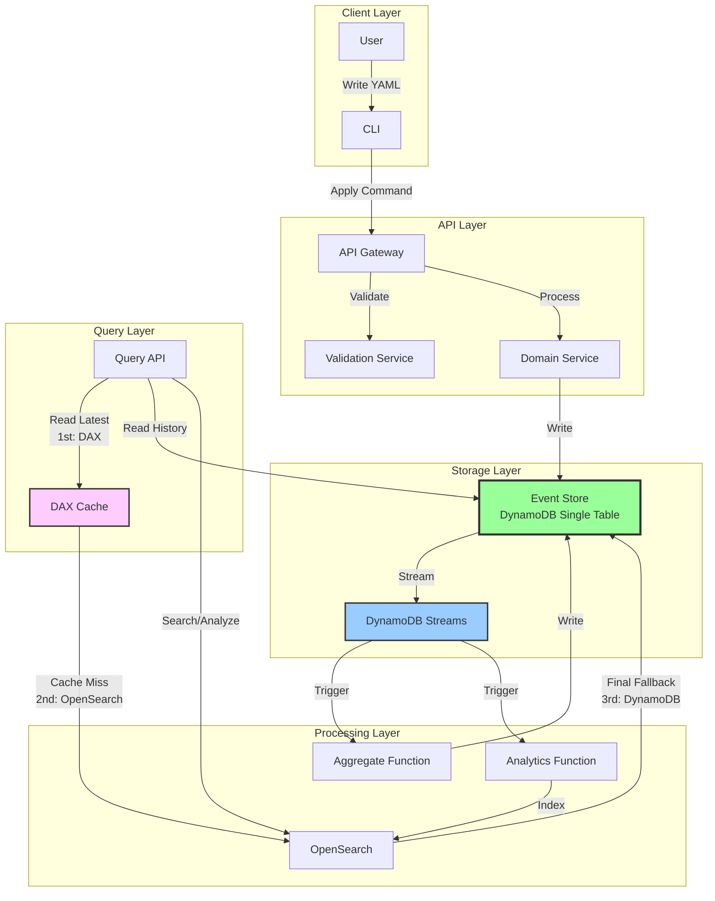
```mermaid
graph TB
    subgraph "Client Layer"
        A[User] -->|Write YAML| B[CLI]
    end

    subgraph "API Layer"
        B -->|Apply Command| C[API Gateway]
        C -->|Validate| D[Validation Service]
        C -->|Process| E[Domain Service]
    end

    subgraph "Storage Layer"
        E -->|Write| F[Event Store<br/>DynamoDB Single Table]
        F -->|Stream| G[DynamoDB Streams]
    end

    subgraph "Processing Layer"
        G -->|Trigger| H[Aggregate Function]
        G -->|Trigger| I[Analytics Function]
        H -->|Write| F
        I -->|Index| J[OpenSearch]
    end

    subgraph "Query Layer"
        K[Query API]
        K -->|Read Latest<br/>1st: DAX| L[DAX Cache]
        L -->|Cache Miss<br/>2nd: OpenSearch| J
        J -->|Final Fallback<br/>3rd: DynamoDB| F
        K -->|Read History| F
        K -->|Search/Analyze| J
    end

    style F fill:#9f9,stroke:#333,stroke-width:3px
    style G fill:#9cf,stroke:#333,stroke-width:2px
    style L fill:#fcf,stroke:#333,stroke-width:2px
```

### 3.3 Key Principles

1. **Declarative State, Not Imperative Commands**: Users declare desired state (like Kubernetes manifests)
2. **Full State Capture**: Each event contains complete domain object state at that moment
3. **Selective Intent Storage**: Intent events stored only when they contain information not in response
4. **Response Enrichment**: Response events contain system-generated metadata and validation results
5. **Multi-Resolution Streams**: Both fine-grained events and coarse-grained aggregates coexist
6. **Query Stability**: New event types don't impact existing queries due to key-based filtering
7. **Multi-Tier Read Path**: DAX for critical reads (microsecond latency), DynamoDB for consistency, OpenSearch for search/analytics with graceful fallback

---

## 4. Core Architecture

### 4.1 Request-Response Event Flow

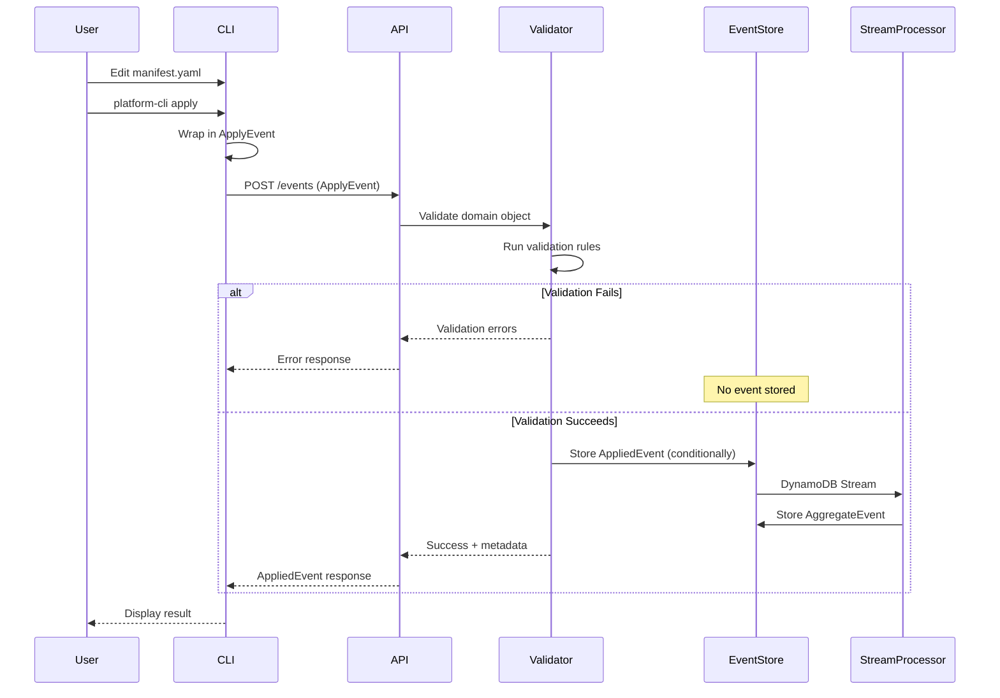
```mermaid
sequenceDiagram
    participant User
    participant CLI
    participant API
    participant Validator
    participant EventStore
    participant StreamProcessor

    User->>CLI: Edit manifest.yaml
    User->>CLI: platform-cli apply

    CLI->>CLI: Wrap in ApplyEvent
    CLI->>API: POST /events (ApplyEvent)

    API->>Validator: Validate domain object
    Validator->>Validator: Run validation rules

    alt Validation Fails
        Validator-->>API: Validation errors
        API-->>CLI: Error response
        Note over EventStore: No event stored
    else Validation Succeeds
        Validator->>EventStore: Store AppliedEvent (conditionally)
        EventStore->>StreamProcessor: DynamoDB Stream
        StreamProcessor->>EventStore: Store AggregateEvent
        Validator-->>API: Success + metadata
        API-->>CLI: AppliedEvent response
    end

    CLI-->>User: Display result
```

### 4.2 Event Envelope Structure

Every event follows a consistent envelope structure:

```yaml
apiVersion: v1alpha1
kind: <DomainObject><Action>Event    # e.g., ArtifactAppliedEvent
meta:
  eventId: uuid-1234                  # Unique event identifier
  timestamp: 2025-01-15T10:30:00Z     # Event creation time
  userId: user@example.com            # Who triggered this
  correlationId: req-5678             # Request correlation
  executionId: exec-9012              # Workflow execution ID
  name: artifact-name                 # Domain object identifier
  appId: "09287"                      # Application context

spec:
  <domainObject>:                     # Nested domain object
    apiVersion: v1alpha1
    kind: <DomainObject>              # e.g., Artifact
    meta:
      name: artifact-name
      appId: "09287"
    spec:
      # Domain-specific fields
      region:
        - us-east-1
        - us-east-2
      bundles:
        - name: a1.zip
          type: terraform
          location: http://artifactory.myco.com/lob1/a1.zip

  # Action-specific metadata
  validation:                         # For ValidatedEvent
    overall: SUCCESS
    details: [...]

  status:                            # For aggregate events
    phase: COMPLETED
    lastUpdated: 2025-01-15T10:30:00Z
```

### 4.3 Event Naming Conventions

Events follow a consistent naming pattern that indicates intent vs. outcome:

| Action | Intent Event (Present Tense) | Outcome Event (Past Tense) |
|--------|------------------------------|----------------------------|
| Validate | `ArtifactValidateEvent` | `ArtifactValidatedEvent` |
| Apply | `ArtifactApplyEvent` | `ArtifactAppliedEvent` |
| Deploy | `DeploymentDeployEvent` | `DeploymentDeployedEvent` |
| Delete | `ArtifactDeleteEvent` | `ArtifactDeletedEvent` |

**Storage Decision Rules:**
- **Intent Event**: Stored only if it contains unique information not in the outcome event (e.g., user comments, client-side metadata)
- **Outcome Event**: Always stored, contains system-generated metadata, validation results, timestamps, IDs

---

## 5. Event Model

### 5.1 Domain Events

Domain events represent state changes to primary domain objects:

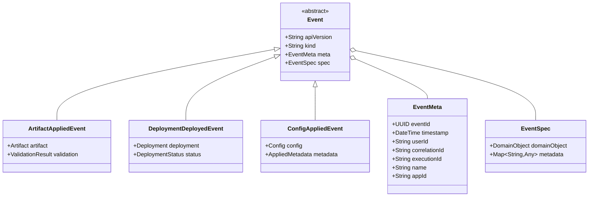
```mermaid
classDiagram
    class Event {
        <<abstract>>
        +String apiVersion
        +String kind
        +EventMeta meta
        +EventSpec spec
    }

    class EventMeta {
        +UUID eventId
        +DateTime timestamp
        +String userId
        +String correlationId
        +String executionId
        +String name
        +String appId
    }

    class EventSpec {
        +DomainObject domainObject
        +Map~String,Any~ metadata
    }

    class ArtifactAppliedEvent {
        +Artifact artifact
        +ValidationResult validation
    }

    class DeploymentDeployedEvent {
        +Deployment deployment
        +DeploymentStatus status
    }

    class ConfigAppliedEvent {
        +Config config
        +AppliedMetadata metadata
    }

    Event <|-- ArtifactAppliedEvent
    Event <|-- DeploymentDeployedEvent
    Event <|-- ConfigAppliedEvent
    Event o-- EventMeta
    Event o-- EventSpec
```

### 5.2 Aggregate Events

Aggregate events summarize and enrich event streams, creating a "meta-stream":

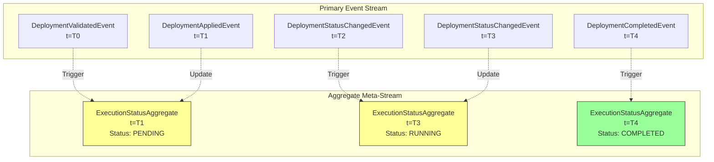
```mermaid
graph TB
    subgraph "Primary Event Stream"
        E1[DeploymentValidatedEvent<br/>t=T0]
        E2[DeploymentAppliedEvent<br/>t=T1]
        E3[DeploymentStatusChangedEvent<br/>t=T2]
        E4[DeploymentStatusChangedEvent<br/>t=T3]
        E5[DeploymentCompletedEvent<br/>t=T4]
    end

    subgraph "Aggregate Meta-Stream"
        A1[ExecutionStatusAggregate<br/>t=T1<br/>Status: PENDING]
        A2[ExecutionStatusAggregate<br/>t=T3<br/>Status: RUNNING]
        A3[ExecutionStatusAggregate<br/>t=T4<br/>Status: COMPLETED]
    end

    E1 -.->|Trigger| A1
    E2 -.->|Update| A1
    E3 -.->|Trigger| A2
    E4 -.->|Update| A2
    E5 -.->|Trigger| A3

    style A1 fill:#ff9,stroke:#333
    style A2 fill:#ff9,stroke:#333
    style A3 fill:#9f9,stroke:#333
```

**Example Aggregate Event:**

```yaml
apiVersion: v1alpha1
kind: ExecutionStatusAggregate
meta:
  eventId: agg-uuid-5678
  timestamp: 2025-01-15T10:35:00Z
  executionId: exec-9012
  name: deployment-prod-app
  appId: "09287"

spec:
  summary:
    phase: COMPLETED
    startTime: 2025-01-15T10:30:00Z
    endTime: 2025-01-15T10:35:00Z
    duration: 300s

  enrichment:
    resourceCount: 42
    awsResources:
      - arn: arn:aws:s3:::my-bucket
        type: S3Bucket
        status: ACTIVE
      - arn: arn:aws:lambda:us-east-1:123456789012:function:my-func
        type: LambdaFunction
        status: ACTIVE

  eventStream:
    totalEvents: 47
    firstEventId: evt-001
    lastEventId: evt-047
    eventTypes:
      - DeploymentValidatedEvent: 1
      - DeploymentAppliedEvent: 1
      - DeploymentStatusChangedEvent: 43
      - DeploymentCompletedEvent: 1

  references:
    artifactId: artifact-name
    configIds:
      - config-prod-1
      - config-prod-2
    triggeredBy: user@example.com
```

### 5.3 Event Lifecycle

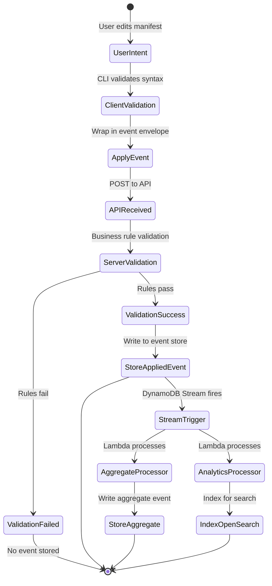
```mermaid
stateDiagram-v2
    [*] --> UserIntent: User edits manifest

    UserIntent --> ClientValidation: CLI validates syntax
    ClientValidation --> ApplyEvent: Wrap in event envelope

    ApplyEvent --> APIReceived: POST to API
    APIReceived --> ServerValidation: Business rule validation

    ServerValidation --> ValidationFailed: Rules fail
    ServerValidation --> ValidationSuccess: Rules pass

    ValidationFailed --> [*]: No event stored

    ValidationSuccess --> StoreAppliedEvent: Write to event store
    StoreAppliedEvent --> StreamTrigger: DynamoDB Stream fires

    StreamTrigger --> AggregateProcessor: Lambda processes
    AggregateProcessor --> StoreAggregate: Write aggregate event

    StreamTrigger --> AnalyticsProcessor: Lambda processes
    AnalyticsProcessor --> IndexOpenSearch: Index for search

    StoreAppliedEvent --> [*]
    StoreAggregate --> [*]
    IndexOpenSearch --> [*]
```

---

## 6. Multi-Resolution Event Streams

### 6.1 Concept

A key innovation in DSEL is the concept of **multi-resolution event streams**. Like a map that can be viewed at different zoom levels, events exist at multiple resolutions:

1. **Fine-Grained Events**: Individual domain object state changes
2. **Coarse-Grained Aggregates**: Summarized, enriched views of event sequences

### 6.2 Resolution Levels

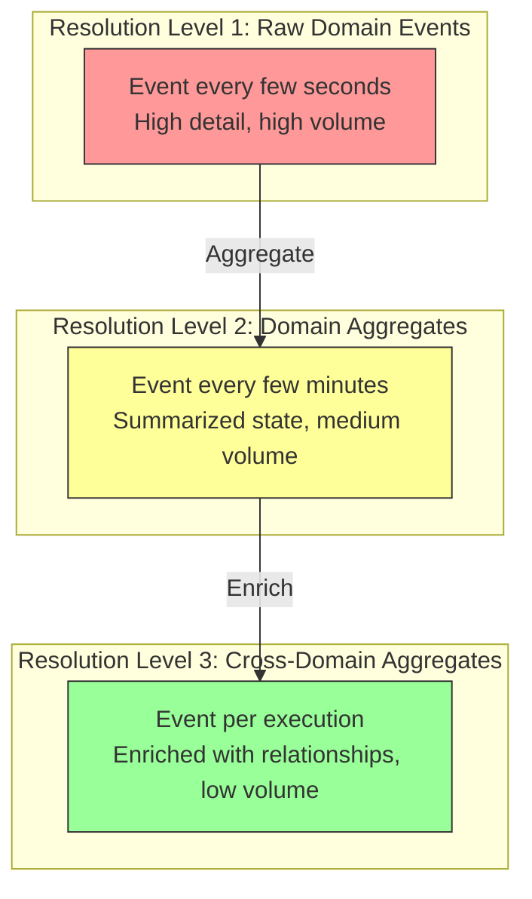
```mermaid
graph TB
    subgraph "Resolution Level 1: Raw Domain Events"
        R1[Event every few seconds<br/>High detail, high volume]
    end

    subgraph "Resolution Level 2: Domain Aggregates"
        R2[Event every few minutes<br/>Summarized state, medium volume]
    end

    subgraph "Resolution Level 3: Cross-Domain Aggregates"
        R3[Event per execution<br/>Enriched with relationships, low volume]
    end

    R1 -->|Aggregate| R2
    R2 -->|Enrich| R3

    style R1 fill:#f99,stroke:#333
    style R2 fill:#ff9,stroke:#333
    style R3 fill:#9f9,stroke:#333
```

### 6.3 Query Efficiency

Different queries operate at different resolutions:

| Query Type | Resolution | Example |
|------------|-----------|---------|
| "What's the current state of Artifact X?" | Fine-grained | Query latest `ArtifactAppliedEvent` |
| "What's the execution status of Deployment Y?" | Medium-grained | Query latest `ExecutionStatusAggregate` |
| "Show all deployments with AWS resource counts" | Coarse-grained | Query `ExecutionStatusAggregate` with enrichment |
| "What changed in the last hour?" | Fine-grained | Query all events with `timestamp > now-1h` |

### 6.4 Aggregate Generation

Aggregates are generated asynchronously via stream processing:

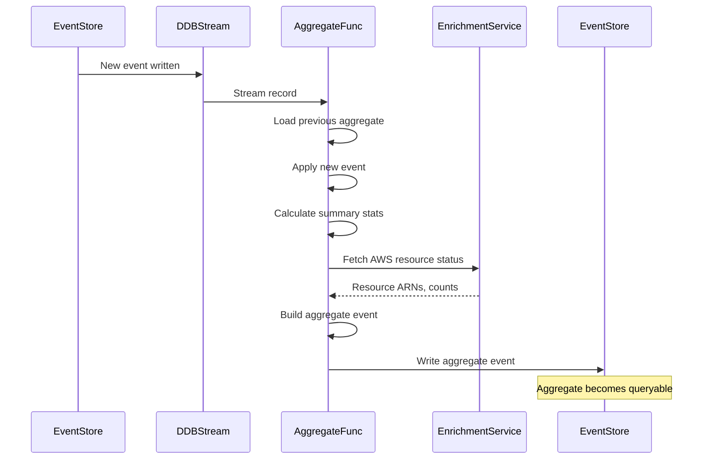
```mermaid
sequenceDiagram
    participant EventStore
    participant DDBStream
    participant AggregateFunc
    participant EnrichmentService
    participant EventStore2 as EventStore

    EventStore->>DDBStream: New event written
    DDBStream->>AggregateFunc: Stream record

    AggregateFunc->>AggregateFunc: Load previous aggregate
    AggregateFunc->>AggregateFunc: Apply new event
    AggregateFunc->>AggregateFunc: Calculate summary stats

    AggregateFunc->>EnrichmentService: Fetch AWS resource status
    EnrichmentService-->>AggregateFunc: Resource ARNs, counts

    AggregateFunc->>AggregateFunc: Build aggregate event
    AggregateFunc->>EventStore2: Write aggregate event

    Note over EventStore2: Aggregate becomes queryable
```

**Key Properties:**
- Aggregates are **events themselves**, stored in the same event store
- Aggregates can be **recomputed** by replaying fine-grained events
- Aggregates **enrich** with external data (AWS APIs, other services)
- Aggregates **summarize** event streams to reduce query load

---

## 7. Storage Implementation

### 7.1 DynamoDB Single Table Design

DSEL uses a single DynamoDB table to store all events with a multi-dimensional key structure:

```mermaid
erDiagram
    EVENT_TABLE {
        string PK "Partition Key"
        string SK "Sort Key"
        string GSI1PK "Global Secondary Index 1 PK"
        string GSI1SK "Global Secondary Index 1 SK"
        string GSI2PK "Global Secondary Index 2 PK"
        string GSI2SK "Global Secondary Index 2 SK"
        json EventData "Complete event payload"
    }
```

### 7.2 Key Design Patterns

#### Pattern 1: Latest State Query

**Use Case**: Get the current state of a domain object

```
PK  = "ARTIFACT#artifact-name#09287"
SK  = "EVENT#<timestamp>#<eventId>"
```

**Query**:
- `PK = "ARTIFACT#artifact-name#09287"`
- `SK begins_with "EVENT#"`
- `ScanIndexForward = false`
- `Limit = 1`

Result: Latest `ArtifactAppliedEvent` for this artifact

#### Pattern 2: Event Type Query

**Use Case**: Get all events of a specific type

```
GSI1PK = "EVENT_TYPE#ArtifactAppliedEvent"
GSI1SK = "TIMESTAMP#<timestamp>"
```

**Query**:
- `GSI1PK = "EVENT_TYPE#ArtifactAppliedEvent"`
- `GSI1SK between "TIMESTAMP#2025-01-01" and "TIMESTAMP#2025-01-31"`

Result: All artifact apply events in January 2025

#### Pattern 3: Execution/Workflow Query

**Use Case**: Get all events for a specific execution (e.g., deployment pipeline)

```
GSI2PK = "EXECUTION#exec-9012"
GSI2SK = "TIMESTAMP#<timestamp>"
```

**Query**:
- `GSI2PK = "EXECUTION#exec-9012"`
- `GSI2SK begins_with "TIMESTAMP#"`

Result: All events related to execution `exec-9012`, chronologically ordered

#### Pattern 4: Aggregate Query

**Use Case**: Get the latest aggregate for efficient queries

```
PK  = "AGGREGATE#ExecutionStatusAggregate#exec-9012"
SK  = "EVENT#<timestamp>#<eventId>"
```

**Query**:
- `PK = "AGGREGATE#ExecutionStatusAggregate#exec-9012"`
- `Limit = 1`
- `ScanIndexForward = false`

Result: Latest aggregate with enriched data, no need to process individual events

### 7.3 Complete Table Schema

```yaml
TableName: PlatformEventStore

KeySchema:
  - AttributeName: PK
    KeyType: HASH
  - AttributeName: SK
    KeyType: RANGE

AttributeDefinitions:
  - AttributeName: PK
    AttributeType: S
  - AttributeName: SK
    AttributeType: S
  - AttributeName: GSI1PK
    AttributeType: S
  - AttributeName: GSI1SK
    AttributeType: S
  - AttributeName: GSI2PK
    AttributeType: S
  - AttributeName: GSI2SK
    AttributeType: S

GlobalSecondaryIndexes:
  - IndexName: GSI1-EventType
    KeySchema:
      - AttributeName: GSI1PK
        KeyType: HASH
      - AttributeName: GSI1SK
        KeyType: RANGE
    Projection:
      ProjectionType: ALL

  - IndexName: GSI2-Execution
    KeySchema:
      - AttributeName: GSI2PK
        KeyType: HASH
      - AttributeName: GSI2SK
        KeyType: RANGE
    Projection:
      ProjectionType: ALL

StreamSpecification:
  StreamEnabled: true
  StreamViewType: NEW_IMAGE

PointInTimeRecoverySpecification:
  PointInTimeRecoveryEnabled: true
```

### 7.4 Key Construction Examples

```python
# Domain object event
PK  = f"ARTIFACT#{name}#{appId}"
SK  = f"EVENT#{timestamp}#{eventId}"
GSI1PK = f"EVENT_TYPE#{kind}"  # e.g., "EVENT_TYPE#ArtifactAppliedEvent"
GSI1SK = f"TIMESTAMP#{timestamp}"
GSI2PK = f"EXECUTION#{executionId}"
GSI2SK = f"TIMESTAMP#{timestamp}"

# Aggregate event
PK  = f"AGGREGATE#{aggregateType}#{executionId}"
SK  = f"EVENT#{timestamp}#{eventId}"
GSI1PK = f"EVENT_TYPE#{kind}"  # e.g., "EVENT_TYPE#ExecutionStatusAggregate"
GSI1SK = f"TIMESTAMP#{timestamp}"
GSI2PK = f"EXECUTION#{executionId}"
GSI2SK = f"TIMESTAMP#{timestamp}"

# User activity query (optional GSI3)
GSI3PK = f"USER#{userId}"
GSI3SK = f"TIMESTAMP#{timestamp}"
```

### 7.5 Query Stability Through Key Design

**Key Insight**: New event types automatically get their own `GSI1PK` values, so existing queries never see them:

```python
# Query for all ArtifactAppliedEvent - will NEVER return new ConfigAppliedEvent
query(GSI1PK = "EVENT_TYPE#ArtifactAppliedEvent")

# Query for specific artifact - will NEVER return other artifacts
query(PK = "ARTIFACT#my-artifact#09287")
```

This enables **zero-downtime schema evolution**:
- Add new domain objects → new `PK` patterns
- Add new event types → new `GSI1PK` values
- Add new aggregates → new `PK` patterns
- Existing queries unaffected

---

## 8. Comparison with Existing Patterns

### 8.1 Event Sourcing

| Aspect | Traditional Event Sourcing | DSEL |
|--------|---------------------------|------|
| **Event Content** | Deltas/changes only | Full state snapshots |
| **State Reconstruction** | Replay all events | Query latest event |
| **Query Complexity** | O(n) where n = event count | O(1) for latest state |
| **Storage Cost** | Low (deltas) | Higher (full state) |
| **Schema Evolution** | Complex (must handle old event versions) | Simple (old events remain valid) |
| **Temporal Queries** | Replay to point in time | Direct query at timestamp |
| **Aggregate Pattern** | Separate projection/read models | Aggregates are events in same store |

**Example: Get Current State**

Event Sourcing:
```python
events = get_all_events(entity_id)
state = {}
for event in events:
    state = apply_event(state, event)  # Replay
return state
```

DSEL:
```python
latest_event = query_latest_event(entity_id)
return latest_event.spec.domainObject  # Direct access
```

### 8.2 CQRS

| Aspect | CQRS | DSEL |
|--------|------|------|
| **Write Model** | Separate command handlers | Event API |
| **Read Model** | Separate projections | Events ARE the read model |
| **Consistency** | Eventual consistency between models | Strong consistency (single store) |
| **Projection Maintenance** | Must maintain multiple projections | Optional aggregates only |
| **Query Performance** | Optimized read models | DynamoDB key-based queries |
| **Complexity** | High (multiple models to sync) | Lower (single event store) |

### 8.3 Change Data Capture (CDC)

| Aspect | CDC (e.g., Debezium) | DSEL |
|--------|---------------------|------|
| **Source of Truth** | Database tables | Event store |
| **Capture Method** | Database logs/triggers | Application-level events |
| **Intent Capture** | No (only outcomes) | Yes (request-response pairs) |
| **Schema** | Database schema | Event schema |
| **Declarative Semantics** | No | Yes (Kubernetes-style) |

### 8.4 Kafka with Compacted Topics

| Aspect | Kafka Compacted Topics | DSEL |
|--------|----------------------|------|
| **Latest State** | Log compaction by key | Query latest event by PK |
| **History** | Compaction removes old entries | All events retained |
| **Query Model** | Stream consumption | Direct queries (DynamoDB) |
| **Multi-Dimensional Queries** | Single key partition | Multiple GSIs |
| **Aggregates** | KStreams/ksqlDB | Lambda stream processors |

### 8.5 Pattern Comparison Matrix

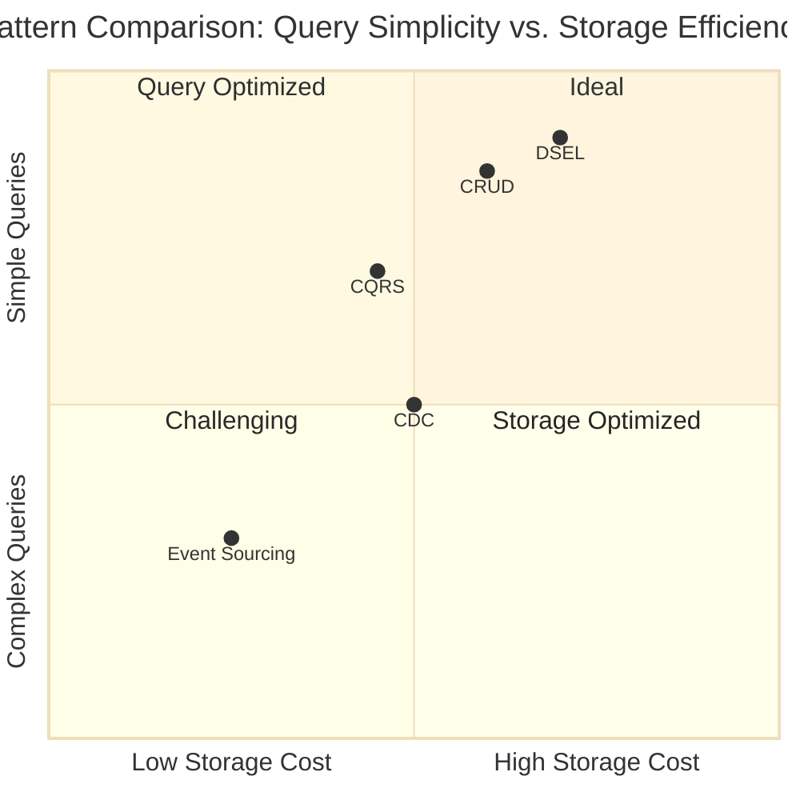
```mermaid
%%{init: {'theme':'base'}}%%
quadrantChart
    title Pattern Comparison: Query Simplicity vs. Storage Efficiency
    x-axis Low Storage Cost --> High Storage Cost
    y-axis Complex Queries --> Simple Queries
    quadrant-1 Ideal
    quadrant-2 Query Optimized
    quadrant-3 Challenging
    quadrant-4 Storage Optimized
    Event Sourcing: [0.25, 0.3]
    CQRS: [0.45, 0.7]
    CRUD: [0.6, 0.85]
    DSEL: [0.7, 0.9]
    CDC: [0.5, 0.5]
```

**Key Takeaway**: DSEL trades storage cost for query simplicity and operational flexibility—a pragmatic choice when storage is cheap and developer time is expensive.

---

## 9. Benefits and Tradeoffs

### 9.1 Benefits

#### 1. Zero-Cost Time Travel

**Traditional Event Sourcing:**
```python
# Must replay 10,000 events to get state at T-1000
events = get_events_until(entity_id, timestamp=T-1000)
state = replay_events(events)  # Expensive!
```

**DSEL:**
```python
# Direct query for state at T-1000
event = query_latest_event_before(entity_id, timestamp=T-1000)
state = event.spec.domainObject  # Immediate!
```

#### 2. Schema Evolution Without Migration

Adding a new domain object type (e.g., `Pipeline`):

```yaml
# New event type
apiVersion: v1alpha1
kind: PipelineAppliedEvent
meta:
  name: pipeline-prod
  appId: "12345"
spec:
  pipeline:
    # New schema
    stages: [...]
```

**Impact on existing queries**: ZERO
- Existing queries filter by `PK` pattern or `GSI1PK` event type
- New `PipelineAppliedEvent` events have different keys
- No migrations, no downtime, no breaking changes

#### 3. Built-In Audit Trail

Every event contains:
- `userId`: Who made the change
- `timestamp`: When it happened
- `correlationId`: Which request triggered it
- `domainObject`: Complete state before and after

**Compliance queries:**
```sql
-- Who modified artifact X in the last 30 days?
SELECT userId, timestamp, spec
FROM events
WHERE PK = 'ARTIFACT#X#appId'
  AND SK > 'EVENT#2025-01-01'
```

#### 4. Stream Processing for Analytics

DynamoDB Streams automatically trigger downstream processing:

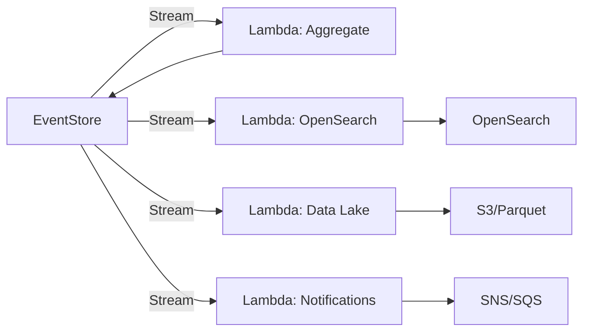
```mermaid
graph LR
    A[EventStore] -->|Stream| B[Lambda: Aggregate]
    A -->|Stream| C[Lambda: OpenSearch]
    A -->|Stream| D[Lambda: Data Lake]
    A -->|Stream| E[Lambda: Notifications]

    B --> A
    C --> F[OpenSearch]
    D --> G[S3/Parquet]
    E --> H[SNS/SQS]
```

- **OpenSearch**: Full-text search, analytics dashboards
- **Data Lake**: Long-term storage, compliance, data science
- **Notifications**: Real-time alerts on specific events
- **Aggregates**: Efficient query summaries

#### 5. Efficient Multi-Resolution Queries

```python
# Fine-grained: Get every state change
events = query_all_events(artifact_id)

# Medium-grained: Get execution summaries
aggregate = query_latest_aggregate(execution_id)

# Coarse-grained: Get daily summaries
daily_agg = query_daily_aggregate(app_id, date)
```

Each query operates at the appropriate resolution, avoiding over-fetching.

#### 6. Multi-Tier Read Path Performance

DSEL supports a tiered read architecture optimized for different latency requirements:

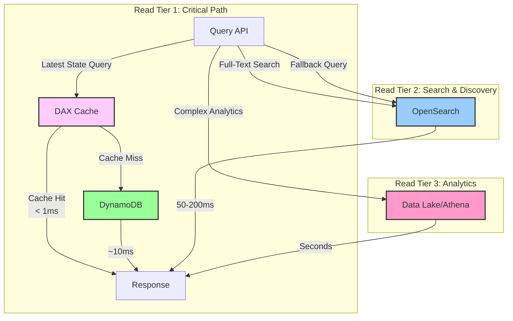
```mermaid
graph TB
    subgraph "Read Tier 1: Critical Path"
        A[Query API] -->|Latest State Query| B[DAX Cache]
        B -->|Cache Hit<br/>< 1ms| C[Response]
        B -->|Cache Miss| D[DynamoDB]
        D -->|~10ms| C
    end

    subgraph "Read Tier 2: Search & Discovery"
        A -->|Full-Text Search| E[OpenSearch]
        E -->|50-200ms| C
        A -->|Fallback Query| E
    end

    subgraph "Read Tier 3: Analytics"
        A -->|Complex Analytics| F[Data Lake/Athena]
        F -->|Seconds| C
    end

    style B fill:#fcf,stroke:#333,stroke-width:2px
    style D fill:#9f9,stroke:#333,stroke-width:2px
    style E fill:#9cf,stroke:#333,stroke-width:2px
    style F fill:#f9c,stroke:#333,stroke-width:2px
```

**Performance Characteristics:**

| Tier | Technology | Latency | Use Case | Cost |
|------|------------|---------|----------|------|
| 1 | DAX | < 1ms | Latest state reads (hot items) | $$$ |
| 2 | DynamoDB | ~10ms | Latest state (cold items), history | $$ |
| 3 | OpenSearch | ~100ms | Full-text search, discovery, fallback | $$ |
| 4 | Data Lake | ~seconds | Complex analytics, compliance reports | $ |

**Graceful Degradation:**
```
Read Latest Query Path:
1. DAX unavailable/miss → Fallback to OpenSearch (eventual consistency, ~100ms)
2. OpenSearch unavailable → Final fallback to DynamoDB (source of truth, ~10ms)

Alternative: Direct DynamoDB reads bypass DAX/OpenSearch when strong consistency required
```

This multi-tier approach ensures:
- **Critical paths** (deployment validation, apply operations) get microsecond latency via DAX
- **User-facing searches** leverage OpenSearch's powerful query capabilities
- **Cost optimization** by caching only hot items in DAX
- **Resilience** through automatic fallback: DAX → OpenSearch → DynamoDB
- **Flexibility** - clients choose path based on consistency/latency requirements

#### 7. Debuggability

When production issues occur:

```python
# What did the user actually send?
apply_event = query_event(event_type="ArtifactApplyEvent", correlation_id=X)

# What did the system actually save?
applied_event = query_event(event_type="ArtifactAppliedEvent", correlation_id=X)

# Compare intent vs. outcome
diff = compare(apply_event.spec.artifact, applied_event.spec.artifact)
```

#### 7. Declarative API Experience

Users benefit from Kubernetes-style workflows:

```bash
# Edit manifest
vim artifact.yaml

# Validate locally
platform-cli validate artifact.yaml

# Apply to system
platform-cli apply artifact.yaml

# View current state
platform-cli get artifact artifact-name

# View history
platform-cli history artifact artifact-name
```

### 9.2 Tradeoffs

#### 1. Storage Cost

**Cost**: Storing full state in every event increases storage

**Mitigation Strategies:**
- Use DynamoDB On-Demand pricing for variable workloads
- Archive old events to S3 Glacier (DynamoDB exports)
- Only store intent events when they differ from outcome
- Use compression (DynamoDB doesn't compress, but application can)

**Cost Analysis:**
```
Assume:
- 1 million events/month
- Average event size: 5 KB
- DynamoDB storage: $0.25/GB/month

Monthly cost: (1M * 5KB) / 1GB * $0.25 = $1.25/month
```

For most platforms, this is negligible compared to compute/network costs.

#### 2. Data Duplication

**Issue**: Intent and outcome events may contain similar data

**Mitigation:**
- Only store intent event if it contains unique information
- Store reference to intent event in outcome event instead of duplicating

```yaml
# Applied event references Apply event instead of duplicating
kind: ArtifactAppliedEvent
spec:
  artifact: { ... }  # Full state
  appliedFrom:
    eventId: apply-event-uuid  # Reference to intent
    userComment: "Deploying to prod"  # Unique intent data
```

#### 3. Write Amplification (for Aggregates)

**Issue**: Every fine-grained event triggers aggregate updates

**Mitigation:**
- Use batching: Update aggregates every N events or M seconds
- Use DynamoDB Streams filtering to only trigger on specific event types
- Make aggregate generation async and idempotent

```python
# Lambda function with batching
def aggregate_function(event):
    records = event['Records']
    batch = [r for r in records if should_aggregate(r)]

    if len(batch) < BATCH_SIZE and time_since_last < BATCH_TIMEOUT:
        return  # Wait for more events

    generate_aggregate(batch)
```

#### 4. Eventual Consistency (for Aggregates)

**Issue**: Aggregates are updated asynchronously, may lag behind fine-grained events

**Mitigation:**
- Document aggregate lag in API contracts
- Provide "consistency level" parameter in queries:
  ```python
  # Strong consistency: Query fine-grained events
  get_state(artifact_id, consistency="strong")

  # Eventual consistency: Query aggregate (faster)
  get_state(artifact_id, consistency="eventual")
  ```

#### 5. Query Pattern Limitations

**Issue**: DynamoDB requires well-defined access patterns

**Mitigation:**
- Use OpenSearch for ad-hoc queries and analytics
- Design GSIs for known access patterns
- Use DynamoDB Streams to feed data warehouses for complex queries

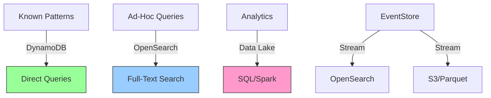
```mermaid
graph TB
    A[Known Patterns] -->|DynamoDB| B[Direct Queries]
    C[Ad-Hoc Queries] -->|OpenSearch| D[Full-Text Search]
    E[Analytics] -->|Data Lake| F[SQL/Spark]

    G[EventStore] -->|Stream| H[OpenSearch]
    G -->|Stream| I[S3/Parquet]

    style B fill:#9f9,stroke:#333
    style D fill:#9cf,stroke:#333
    style F fill:#f9c,stroke:#333
```

#### 6. Read Path Optimization with DAX

**Enhancement**: For critical, high-throughput read paths, DynamoDB Accelerator (DAX) provides microsecond-latency caching.

**Architecture:**

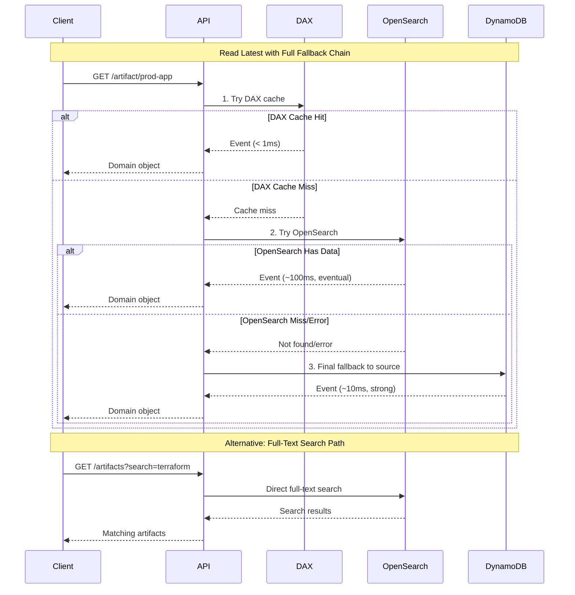
```mermaid
sequenceDiagram
    participant Client
    participant API
    participant DAX
    participant OpenSearch
    participant DynamoDB

    Note over Client,DynamoDB: Read Latest with Full Fallback Chain

    Client->>API: GET /artifact/prod-app
    API->>DAX: 1. Try DAX cache

    alt DAX Cache Hit
        DAX-->>API: Event (< 1ms)
        API-->>Client: Domain object
    else DAX Cache Miss
        DAX-->>API: Cache miss
        API->>OpenSearch: 2. Try OpenSearch

        alt OpenSearch Has Data
            OpenSearch-->>API: Event (~100ms, eventual)
            API-->>Client: Domain object
        else OpenSearch Miss/Error
            OpenSearch-->>API: Not found/error
            API->>DynamoDB: 3. Final fallback to source
            DynamoDB-->>API: Event (~10ms, strong)
            API-->>Client: Domain object
        end
    end

    Note over Client,DynamoDB: Alternative: Full-Text Search Path

    Client->>API: GET /artifacts?search=terraform
    API->>OpenSearch: Direct full-text search
    OpenSearch-->>API: Search results
    API-->>Client: Matching artifacts
```

**Implementation Strategy:**

```python
def get_artifact_state(name, app_id, use_cache=True, strong_consistency=False):
    """
    Multi-tier read path:
    1. DAX cache (microsecond latency) for critical reads
    2. OpenSearch (eventual consistency) for cache misses
    3. DynamoDB (source of truth) as final fallback
    """

    pk = f"ARTIFACT#{name}#{app_id}"

    # Strong consistency path: skip cache, go directly to DynamoDB
    if strong_consistency:
        return get_from_dynamodb(pk)

    if use_cache:
        # Tier 1: DAX-accelerated read
        try:
            response = dax_client.query(
                KeyConditionExpression="PK = :pk AND begins_with(SK, :sk_prefix)",
                ExpressionAttributeValues={
                    ':pk': pk,
                    ':sk_prefix': 'EVENT#'
                },
                ScanIndexForward=False,
                Limit=1
            )
            # DAX cache hit: < 1ms latency
            if response['Items']:
                return response['Items'][0]['spec']['artifact']
        except DAXException as e:
            logger.warning(f"DAX failure, falling back to OpenSearch: {e}")

    # Tier 2: OpenSearch fallback (eventual consistency)
    try:
        result = opensearch_client.search(
            index="platform-events",
            body={
                "query": {
                    "bool": {
                        "must": [
                            {"term": {"meta.name.keyword": name}},
                            {"term": {"meta.appId.keyword": app_id}},
                            {"term": {"kind.keyword": "ArtifactAppliedEvent"}}
                        ]
                    }
                },
                "sort": [{"meta.timestamp": "desc"}],
                "size": 1
            }
        )
        if result['hits']['hits']:
            return result['hits']['hits'][0]['_source']['spec']['artifact']
    except OpenSearchException as e:
        logger.warning(f"OpenSearch failure, falling back to DynamoDB: {e}")

    # Tier 3: DynamoDB as final fallback (source of truth)
    return get_from_dynamodb(pk)

def get_from_dynamodb(pk):
    """Direct DynamoDB read (source of truth)"""
    response = dynamodb_client.query(
        KeyConditionExpression="PK = :pk AND begins_with(SK, :sk_prefix)",
        ExpressionAttributeValues={
            ':pk': pk,
            ':sk_prefix': 'EVENT#'
        },
        ScanIndexForward=False,
        Limit=1
    )

    if response['Items']:
        return response['Items'][0]['spec']['artifact']

    return None

def search_artifacts(query_string, filters=None):
    """
    Tier 3: OpenSearch for full-text search and analytics
    """

    search_body = {
        "query": {
            "bool": {
                "must": [
                    {"match": {"spec.artifact.meta.name": query_string}}
                ],
                "filter": filters or []
            }
        },
        "sort": [{"meta.timestamp": "desc"}],
        "size": 100
    }

    response = opensearch_client.search(
        index="platform-events",
        body=search_body
    )

    return [hit['_source'] for hit in response['hits']['hits']]
```

**Read Path Decision Matrix:**

| Query Type | Tier | Latency | Use Case |
|------------|------|---------|----------|
| Get latest state by ID (cached) | DAX → OpenSearch → DynamoDB | < 1ms → ~100ms → ~10ms | Critical path (deployments, validations) |
| Get latest state (strong consistency) | DynamoDB direct | ~10ms | Immediate after write, critical consistency |
| Get historical state | DynamoDB | ~10-50ms | Time-travel queries, audit |
| Full-text search | OpenSearch | ~50-200ms | User search, discovery |
| Aggregations/analytics | OpenSearch | ~100-500ms | Dashboards, reports |
| Complex SQL queries | Data Lake (Athena) | seconds | Data science, compliance |

**Benefits:**
- **DAX**: Sub-millisecond reads for critical paths (latest state queries, hot items)
- **OpenSearch**: Fast search and analytics, also serves as middle-tier fallback for reads
- **DynamoDB**: Source of truth with strong consistency, final fallback tier
- **Graceful Degradation**: DAX miss/failure → OpenSearch → DynamoDB ensures resilience
- **Consistency Options**: Choose eventual (DAX/OpenSearch) or strong (DynamoDB direct) based on needs

**Cost Optimization:**
```python
# Cache only frequently-accessed items in DAX
def should_use_dax_cache(domain_type, name, app_id):
    """
    DAX cache strategy: Only cache hot items
    """

    # Cache artifacts in production apps
    if domain_type == "ARTIFACT" and is_production_app(app_id):
        return True

    # Cache active deployments
    if domain_type == "DEPLOYMENT" and is_active_deployment(name):
        return True

    # Don't cache historical queries or infrequent items
    return False

# Usage
if should_use_dax_cache("ARTIFACT", name, app_id):
    artifact = get_artifact_state(name, app_id, use_cache=True)
else:
    artifact = get_artifact_state(name, app_id, use_cache=False)
```

### 9.3 When to Use DSEL

**Ideal Use Cases:**
- ✅ Platform engineering (IDPs, Kubernetes-style platforms)
- ✅ Configuration management systems
- ✅ Deployment pipelines and orchestration
- ✅ Infrastructure as Code platforms
- ✅ Audit-heavy, compliance-driven systems
- ✅ Rapidly evolving domain models
- ✅ Multi-tenant SaaS platforms

**Not Ideal For:**
- ❌ High-frequency trading (write amplification)
- ❌ Real-time gaming (latency sensitivity)
- ❌ Simple CRUD apps (over-engineering)
- ❌ Systems with stable, unchanging schemas
- ❌ Storage-constrained environments

---

## 10. Implementation Patterns

### 10.1 Event Schema Versioning

As platforms evolve, event schemas must evolve:

```yaml
# Version 1
apiVersion: v1alpha1
kind: ArtifactAppliedEvent
spec:
  artifact:
    region: us-east-1  # Single region (old)

# Version 2
apiVersion: v1beta1
kind: ArtifactAppliedEvent
spec:
  artifact:
    regions:  # Multi-region (new)
      - us-east-1
      - us-west-2
```

**Handling Strategy:**

```python
def get_artifact_regions(event):
    """Handle both v1alpha1 and v1beta1 schemas"""
    api_version = event['apiVersion']
    artifact = event['spec']['artifact']

    if api_version == 'v1alpha1':
        # Old schema: single region
        return [artifact.get('region', 'us-east-1')]

    elif api_version.startswith('v1beta') or api_version.startswith('v1'):
        # New schema: multiple regions
        return artifact.get('regions', ['us-east-1'])

    else:
        raise UnknownVersionError(api_version)
```

**Best Practices:**
1. Include `apiVersion` in every event
2. Never break backward compatibility within major versions
3. Support N-1 versions (current + previous)
4. Use semantic versioning: `v{major}{stage}{minor}`
   - `v1alpha1` → `v1beta1` → `v1` → `v2alpha1`

### 10.2 Event Validation

Validation occurs at multiple layers:

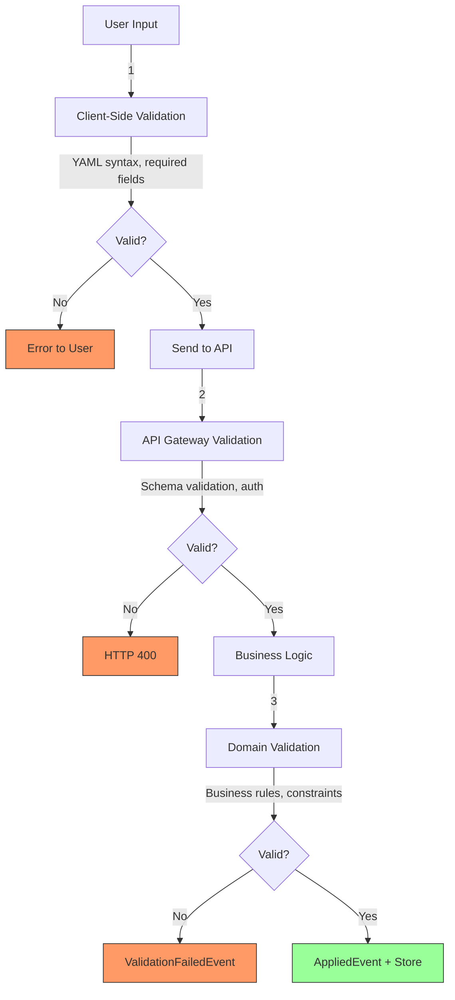
```mermaid
graph TB
    A[User Input] -->|1| B[Client-Side Validation]
    B -->|YAML syntax, required fields| C{Valid?}
    C -->|No| D[Error to User]
    C -->|Yes| E[Send to API]

    E -->|2| F[API Gateway Validation]
    F -->|Schema validation, auth| G{Valid?}
    G -->|No| H[HTTP 400]
    G -->|Yes| I[Business Logic]

    I -->|3| J[Domain Validation]
    J -->|Business rules, constraints| K{Valid?}
    K -->|No| L[ValidationFailedEvent]
    K -->|Yes| M[AppliedEvent + Store]

    style D fill:#f96,stroke:#333
    style H fill:#f96,stroke:#333
    style L fill:#f96,stroke:#333
    style M fill:#9f9,stroke:#333
```

**Example Domain Validation:**

```python
def validate_artifact(artifact):
    """Business rule validation"""
    rules = []

    # Rule 1: Artifact name follows naming convention
    if not re.match(r'^[a-z0-9-]+$', artifact.meta.name):
        rules.append({
            'name': 'naming-convention',
            'pass': False,
            'message': 'Name must be lowercase alphanumeric with hyphens'
        })
    else:
        rules.append({'name': 'naming-convention', 'pass': True})

    # Rule 2: Regions are valid
    valid_regions = ['us-east-1', 'us-west-2', 'eu-west-1']
    for region in artifact.spec.regions:
        if region not in valid_regions:
            rules.append({
                'name': 'valid-regions',
                'pass': False,
                'message': f'Invalid region: {region}'
            })
            break
    else:
        rules.append({'name': 'valid-regions', 'pass': True})

    # Rule 3: Bundle locations are accessible
    # (potentially async check)

    overall = all(r['pass'] for r in rules if 'pass' in r)

    return {
        'overall': 'SUCCESS' if overall else 'FAILED',
        'details': {'validations': rules}
    }
```

### 10.3 Idempotency

All event writes must be idempotent to handle retries:

```python
def store_event(event):
    """Idempotent event storage using eventId as deduplication key"""

    # Use eventId as DynamoDB item key
    try:
        table.put_item(
            Item=event,
            ConditionExpression='attribute_not_exists(eventId)'
        )
        return {'status': 'created', 'eventId': event['eventId']}

    except ClientError as e:
        if e.response['Error']['Code'] == 'ConditionalCheckFailedException':
            # Event already exists, this is a retry
            return {'status': 'already_exists', 'eventId': event['eventId']}
        else:
            raise
```

**Client-Side:**

```python
def apply_artifact(artifact):
    """Client generates idempotency key"""

    # Generate stable eventId based on content + timestamp
    event_id = f"{artifact.meta.name}-{artifact.meta.appId}-{uuid.uuid4()}"
    correlation_id = f"req-{uuid.uuid4()}"

    event = {
        'apiVersion': 'v1alpha1',
        'kind': 'ArtifactApplyEvent',
        'meta': {
            'eventId': event_id,
            'correlationId': correlation_id,
            'timestamp': datetime.utcnow().isoformat(),
            'userId': get_current_user(),
            **artifact.meta
        },
        'spec': {
            'artifact': artifact
        }
    }

    # Safe to retry on failure
    response = api_client.post('/events', event)

    if response.status_code == 409:
        print("Already applied (idempotent retry)")

    return response
```

### 10.4 Query Patterns

#### Pattern: Get Latest State

```python
def get_current_state(domain_type, name, app_id):
    """Get the latest state of a domain object"""

    pk = f"{domain_type.upper()}#{name}#{app_id}"

    response = table.query(
        KeyConditionExpression="PK = :pk AND begins_with(SK, :sk_prefix)",
        ExpressionAttributeValues={
            ':pk': pk,
            ':sk_prefix': 'EVENT#'
        },
        ScanIndexForward=False,  # Descending order (latest first)
        Limit=1
    )

    if response['Items']:
        event = response['Items'][0]
        return event['spec'][domain_type.lower()]
    else:
        return None

# Usage
artifact = get_current_state('ARTIFACT', 'my-artifact', '09287')
```

#### Pattern: Get Event History

```python
def get_event_history(domain_type, name, app_id, limit=100):
    """Get event history for a domain object"""

    pk = f"{domain_type.upper()}#{name}#{app_id}"

    response = table.query(
        KeyConditionExpression="PK = :pk AND begins_with(SK, :sk_prefix)",
        ExpressionAttributeValues={
            ':pk': pk,
            ':sk_prefix': 'EVENT#'
        },
        ScanIndexForward=False,  # Latest first
        Limit=limit
    )

    return response['Items']

# Usage
history = get_event_history('ARTIFACT', 'my-artifact', '09287', limit=50)
for event in history:
    print(f"{event['meta']['timestamp']}: {event['kind']}")
```

#### Pattern: Get State at Point in Time

```python
def get_state_at_time(domain_type, name, app_id, timestamp):
    """Get state as it was at a specific point in time"""

    pk = f"{domain_type.upper()}#{name}#{app_id}"
    sk_max = f"EVENT#{timestamp}#Z"  # Z sorts after any UUID

    response = table.query(
        KeyConditionExpression="PK = :pk AND SK <= :sk_max",
        ExpressionAttributeValues={
            ':pk': pk,
            ':sk_max': sk_max
        },
        ScanIndexForward=False,  # Descending order
        Limit=1
    )

    if response['Items']:
        event = response['Items'][0]
        return {
            'state': event['spec'][domain_type.lower()],
            'as_of': event['meta']['timestamp'],
            'event_id': event['meta']['eventId']
        }
    else:
        return None

# Usage
historical_state = get_state_at_time(
    'ARTIFACT',
    'my-artifact',
    '09287',
    '2025-01-15T10:00:00Z'
)
```

#### Pattern: Get Execution Events

```python
def get_execution_events(execution_id):
    """Get all events for a specific execution/workflow"""

    response = table.query(
        IndexName='GSI2-Execution',
        KeyConditionExpression="GSI2PK = :pk",
        ExpressionAttributeValues={
            ':pk': f"EXECUTION#{execution_id}"
        },
        ScanIndexForward=True  # Chronological order
    )

    return response['Items']

# Usage
events = get_execution_events('exec-9012')
for event in events:
    print(f"{event['kind']} at {event['meta']['timestamp']}")
```

#### Pattern: Get Latest Aggregate

```python
def get_execution_status(execution_id):
    """Get efficient status summary via aggregate"""

    pk = f"AGGREGATE#ExecutionStatusAggregate#{execution_id}"

    response = table.query(
        KeyConditionExpression="PK = :pk",
        ExpressionAttributeValues={
            ':pk': pk
        },
        ScanIndexForward=False,
        Limit=1
    )

    if response['Items']:
        aggregate = response['Items'][0]
        return aggregate['spec']['summary']
    else:
        return None

# Usage
status = get_execution_status('exec-9012')
print(f"Phase: {status['phase']}, Duration: {status['duration']}")
```

### 10.5 Stream Processing

DynamoDB Streams trigger Lambda functions for downstream processing:

```python
def aggregate_handler(event, context):
    """Lambda function to generate aggregate events"""

    for record in event['Records']:
        if record['eventName'] != 'INSERT':
            continue

        new_image = record['dynamodb']['NewImage']
        event_data = deserialize(new_image)

        # Only process certain event types
        if not should_aggregate(event_data):
            continue

        execution_id = event_data['meta']['executionId']

        # Load previous aggregate (if exists)
        previous_agg = get_latest_aggregate(execution_id)

        # Update aggregate with new event
        updated_agg = update_aggregate(previous_agg, event_data)

        # Enrich with external data
        updated_agg = enrich_aggregate(updated_agg)

        # Store new aggregate event
        store_event(updated_agg)

def should_aggregate(event):
    """Determine if event should trigger aggregate update"""
    aggregate_types = [
        'DeploymentDeployedEvent',
        'DeploymentStatusChangedEvent',
        'DeploymentCompletedEvent',
        'DeploymentFailedEvent'
    ]
    return event['kind'] in aggregate_types

def update_aggregate(previous, new_event):
    """Apply new event to aggregate"""

    if previous is None:
        # First event, initialize aggregate
        aggregate = {
            'apiVersion': 'v1alpha1',
            'kind': 'ExecutionStatusAggregate',
            'meta': {
                'eventId': f"agg-{uuid.uuid4()}",
                'timestamp': datetime.utcnow().isoformat(),
                'executionId': new_event['meta']['executionId'],
                'name': new_event['meta']['name'],
                'appId': new_event['meta']['appId']
            },
            'spec': {
                'summary': {
                    'phase': 'PENDING',
                    'startTime': new_event['meta']['timestamp'],
                    'eventCount': 1
                },
                'eventStream': {
                    'firstEventId': new_event['meta']['eventId'],
                    'lastEventId': new_event['meta']['eventId']
                }
            }
        }
    else:
        # Update existing aggregate
        aggregate = copy.deepcopy(previous)
        aggregate['meta']['eventId'] = f"agg-{uuid.uuid4()}"
        aggregate['meta']['timestamp'] = datetime.utcnow().isoformat()
        aggregate['spec']['summary']['eventCount'] += 1
        aggregate['spec']['eventStream']['lastEventId'] = new_event['meta']['eventId']

        # Update phase based on new event
        if new_event['kind'] == 'DeploymentCompletedEvent':
            aggregate['spec']['summary']['phase'] = 'COMPLETED'
            aggregate['spec']['summary']['endTime'] = new_event['meta']['timestamp']
        elif new_event['kind'] == 'DeploymentFailedEvent':
            aggregate['spec']['summary']['phase'] = 'FAILED'

    return aggregate

def enrich_aggregate(aggregate):
    """Enrich with external data (AWS resources, etc.)"""

    execution_id = aggregate['meta']['executionId']

    # Query AWS for deployed resources
    resources = aws_client.list_resources_by_tag(
        TagFilters=[
            {'Key': 'ExecutionId', 'Values': [execution_id]}
        ]
    )

    aggregate['spec']['enrichment'] = {
        'resourceCount': len(resources),
        'awsResources': [
            {
                'arn': r['ResourceARN'],
                'type': r['ResourceType']
            }
            for r in resources
        ]
    }

    return aggregate
```

---

## 11. Global Distribution and Multi-Region Consistency

### 11.1 Global Platform State

One of DSEL's most powerful capabilities emerges when combined with globally-distributed, strongly-consistent databases like **DynamoDB Global Tables** or **Cassandra**. This enables a **globally consistent platform state** accessible from any region with local latency.

### 11.2 Multi-Region Architecture

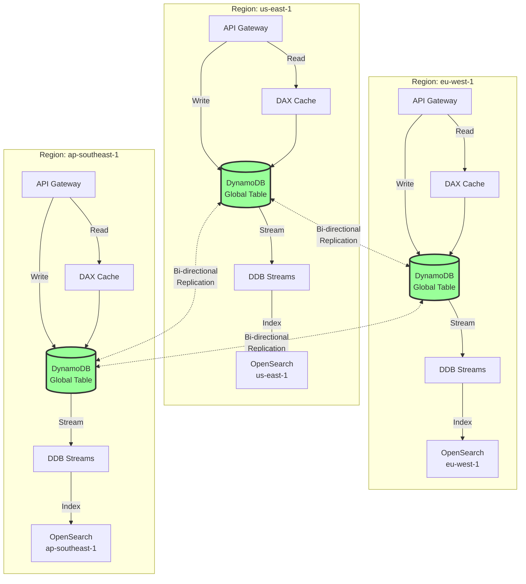
```mermaid
graph TB
    subgraph "Region: us-east-1"
        API1[API Gateway]
        DDB1[(DynamoDB<br/>Global Table)]
        DAX1[DAX Cache]
        STREAM1[DDB Streams]
        OS1[OpenSearch<br/>us-east-1]

        API1 -->|Write| DDB1
        API1 -->|Read| DAX1
        DAX1 --> DDB1
        DDB1 -->|Stream| STREAM1
        STREAM1 -->|Index| OS1
    end

    subgraph "Region: eu-west-1"
        API2[API Gateway]
        DDB2[(DynamoDB<br/>Global Table)]
        DAX2[DAX Cache]
        STREAM2[DDB Streams]
        OS2[OpenSearch<br/>eu-west-1]

        API2 -->|Write| DDB2
        API2 -->|Read| DAX2
        DAX2 --> DDB2
        DDB2 -->|Stream| STREAM2
        STREAM2 -->|Index| OS2
    end

    subgraph "Region: ap-southeast-1"
        API3[API Gateway]
        DDB3[(DynamoDB<br/>Global Table)]
        DAX3[DAX Cache]
        STREAM3[DDB Streams]
        OS3[OpenSearch<br/>ap-southeast-1]

        API3 -->|Write| DDB3
        API3 -->|Read| DAX3
        DAX3 --> DDB3
        DDB3 -->|Stream| STREAM3
        STREAM3 -->|Index| OS3
    end

    DDB1 <-.->|Bi-directional<br/>Replication| DDB2
    DDB2 <-.->|Bi-directional<br/>Replication| DDB3
    DDB3 <-.->|Bi-directional<br/>Replication| DDB1

    style DDB1 fill:#9f9,stroke:#333,stroke-width:3px
    style DDB2 fill:#9f9,stroke:#333,stroke-width:3px
    style DDB3 fill:#9f9,stroke:#333,stroke-width:3px
```

### 11.3 Key Characteristics

#### Global Consistency

**DynamoDB Global Tables** (or **Cassandra** with appropriate consistency levels) provide:

1. **Multi-Master Writes**: Write to any region, automatically replicated to all others
2. **Strong Consistency**: Reads in the local region reflect all committed writes
3. **Last-Writer-Wins**: Conflict resolution based on timestamps (aligns with DSEL's event timestamps)
4. **Sub-Second Replication**: Typically < 1 second cross-region propagation

**For DSEL:**
```python
# Write in us-east-1
api_us.apply_artifact(artifact)  # Event stored in us-east-1

# Read in eu-west-1 (after ~1 second)
artifact = api_eu.get_artifact(name, app_id)  # Same event available
```

#### Regional OpenSearch Clusters

Each region maintains its **own OpenSearch cluster**, populated via **regional DynamoDB Streams**:

```python
# Regional stream processing (us-east-1)
def process_stream_us_east(event):
    for record in event['Records']:
        event_data = deserialize(record['dynamodb']['NewImage'])

        # Index to regional OpenSearch
        opensearch_us_east_client.index(
            index='platform-events',
            id=event_data['meta']['eventId'],
            body=event_data
        )
```

**Benefits:**
- **Regional isolation**: OpenSearch outage in one region doesn't affect others
- **Local latency**: Search queries served from regional cluster (~10-50ms)
- **Independent scaling**: Each region scales based on local query load
- **Data sovereignty**: Option to filter events by region for compliance

### 11.4 Global Query Patterns

#### Pattern 1: Local Read with Global Write

```python
# Developer in Europe writes artifact
cli_europe = PlatformCLI(region='eu-west-1')
cli_europe.apply('artifact.yaml')

# Event written to eu-west-1 DynamoDB Global Table
# Replicated to us-east-1 and ap-southeast-1 within ~1 second

# Developer in US reads same artifact
cli_us = PlatformCLI(region='us-east-1')
artifact = cli_us.get('artifact', 'artifact-name')  # Local read, global data
```

#### Pattern 2: Regional Failover

```python
def get_artifact_with_failover(name, app_id, primary_region='us-east-1'):
    """
    Multi-region failover for critical reads
    """

    regions = ['us-east-1', 'eu-west-1', 'ap-southeast-1']
    regions.remove(primary_region)
    regions.insert(0, primary_region)  # Try primary first

    for region in regions:
        try:
            client = get_ddb_client(region)
            response = client.query(
                KeyConditionExpression="PK = :pk",
                ExpressionAttributeValues={
                    ':pk': f"ARTIFACT#{name}#{app_id}"
                },
                Limit=1
            )
            if response['Items']:
                return response['Items'][0]['spec']['artifact']
        except Exception as e:
            logger.warning(f"Region {region} failed, trying next: {e}")
            continue

    raise AllRegionsFailedError("Unable to read from any region")
```

#### Pattern 3: Global Event Audit

```python
# Compliance query: Show all changes to production artifacts globally
def audit_global_changes(app_id, start_date, end_date):
    """
    Query all regions to build complete global audit trail
    """

    all_events = []

    for region in ['us-east-1', 'eu-west-1', 'ap-southeast-1']:
        opensearch_client = get_opensearch_client(region)

        results = opensearch_client.search(
            index='platform-events',
            body={
                "query": {
                    "bool": {
                        "must": [
                            {"term": {"meta.appId.keyword": app_id}},
                            {"range": {"meta.timestamp": {
                                "gte": start_date,
                                "lte": end_date
                            }}}
                        ]
                    }
                },
                "sort": [{"meta.timestamp": "asc"}]
            }
        )

        all_events.extend(results['hits']['hits'])

    # Deduplicate by eventId (same event indexed in multiple regions)
    unique_events = {e['_source']['meta']['eventId']: e for e in all_events}

    return sorted(unique_events.values(),
                  key=lambda e: e['_source']['meta']['timestamp'])
```

### 11.5 Benefits of Global Distribution

#### 1. Global Platform Consistency

**Single Source of Truth**: All regions share the same platform state
```yaml
# Artifact applied in us-east-1
kind: ArtifactAppliedEvent
meta:
  eventId: evt-12345
  timestamp: 2025-01-15T10:30:00Z
  region: us-east-1  # Origin region

# Automatically available in all regions for reads
```

#### 2. Regional Failover and High Availability

```
Region Availability Scenarios:

Scenario 1: us-east-1 DynamoDB unavailable
→ Automatic failover to eu-west-1 or ap-southeast-1
→ Platform remains operational globally

Scenario 2: eu-west-1 OpenSearch down
→ Search queries in EU can fallback to us-east-1 OpenSearch
→ Or query DynamoDB directly (slower but works)

Scenario 3: Complete region failure
→ Traffic routes to healthy regions
→ No data loss (global replication)
```

#### 3. Low-Latency Global Access

| Operation | Regional Latency | Cross-Region Latency |
|-----------|-----------------|---------------------|
| Write Event | ~20ms (local DDB write) | ~1s (replication) |
| Read Latest (DAX) | < 1ms (local cache) | N/A (data already replicated) |
| Read Latest (DDB) | ~10ms (local DDB) | ~10ms (replicated data is local) |
| Search (OpenSearch) | ~50ms (regional cluster) | ~200ms (cross-region query) |

**Key Insight**: After initial ~1s replication delay, ALL reads are local latency!

#### 4. Disaster Recovery

```python
# Complete region disaster recovery
def recover_region(failed_region, target_region):
    """
    Regional recovery is automatic with Global Tables:
    1. Traffic routes to healthy regions (Route53, load balancer)
    2. Data already replicated to other regions
    3. OpenSearch rebuilt from DynamoDB streams in healthy region
    """

    # When failed region recovers:
    # 1. DynamoDB Global Table automatically syncs
    # 2. Rebuild regional OpenSearch from DynamoDB

    ddb_client = get_ddb_client(target_region)
    os_client = get_opensearch_client(failed_region)

    # Scan all events and reindex
    paginator = ddb_client.get_paginator('scan')
    for page in paginator.paginate(TableName='PlatformEventStore'):
        for item in page['Items']:
            os_client.index(
                index='platform-events',
                id=item['meta']['eventId'],
                body=item
            )
```

#### 5. Compliance and Data Sovereignty

```python
# Regional data isolation (optional)
def should_replicate_to_region(event, target_region):
    """
    Optional: Filter events by region for data sovereignty
    """

    # Example: EU data stays in EU
    if event['meta'].get('dataClassification') == 'EU_ONLY':
        return target_region.startswith('eu-')

    # Example: US government data stays in US
    if event['meta'].get('dataClassification') == 'FedRAMP':
        return target_region.startswith('us-gov-')

    return True  # Default: replicate globally
```

### 11.6 Implementation Considerations

#### DynamoDB Global Tables Setup

```yaml
# CloudFormation/Terraform
GlobalTable:
  Type: AWS::DynamoDB::GlobalTable
  Properties:
    TableName: PlatformEventStore
    BillingMode: PAY_PER_REQUEST
    StreamSpecification:
      StreamViewType: NEW_IMAGE
    Replicas:
      - Region: us-east-1
        PointInTimeRecoverySpecification:
          PointInTimeRecoveryEnabled: true
        TableClass: STANDARD
      - Region: eu-west-1
        PointInTimeRecoverySpecification:
          PointInTimeRecoveryEnabled: true
        TableClass: STANDARD
      - Region: ap-southeast-1
        PointInTimeRecoverySpecification:
          PointInTimeRecoveryEnabled: true
        TableClass: STANDARD
```

#### Regional Stream Processing

```python
# Each region processes its own DynamoDB Stream
# Lambda function deployed in EACH region

def lambda_handler(event, context):
    """
    Regional stream processor
    Runs independently in each region
    """

    region = os.environ['AWS_REGION']
    os_client = get_opensearch_client(region)

    for record in event['Records']:
        if record['eventName'] == 'INSERT':
            event_data = deserialize(record['dynamodb']['NewImage'])

            # Index to regional OpenSearch
            os_client.index(
                index='platform-events',
                id=event_data['meta']['eventId'],
                body=event_data
            )

            # Also trigger regional aggregate processing
            process_aggregate(event_data, region)
```

#### Handling Replication Lag

```python
def write_and_verify_global(event, timeout=5):
    """
    Write to local region and verify replication to other regions
    """

    local_region = os.environ['AWS_REGION']
    event_id = event['meta']['eventId']

    # Write to local region
    local_client = get_ddb_client(local_region)
    local_client.put_item(TableName='PlatformEventStore', Item=event)

    # Verify replication to other regions
    other_regions = ['us-east-1', 'eu-west-1', 'ap-southeast-1']
    other_regions.remove(local_region)

    start_time = time.time()
    while time.time() - start_time < timeout:
        replicated = True
        for region in other_regions:
            client = get_ddb_client(region)
            response = client.get_item(
                TableName='PlatformEventStore',
                Key={'PK': event['PK'], 'SK': event['SK']}
            )
            if 'Item' not in response:
                replicated = False
                break

        if replicated:
            return True

        time.sleep(0.1)

    raise ReplicationTimeoutError(f"Event not replicated within {timeout}s")
```

### 11.7 Cassandra Alternative

For organizations using **Apache Cassandra** or **DataStax Astra**, DSEL works equally well:

```cql
-- Cassandra multi-datacenter setup
CREATE KEYSPACE platform_events
WITH replication = {
    'class': 'NetworkTopologyStrategy',
    'us-east-1': 3,
    'eu-west-1': 3,
    'ap-southeast-1': 3
};

CREATE TABLE platform_events.events (
    pk text,
    sk text,
    event_data text,  -- JSON blob
    timestamp timestamp,
    PRIMARY KEY (pk, sk)
) WITH CLUSTERING ORDER BY (sk DESC);

-- Read with local quorum
SELECT * FROM events WHERE pk = 'ARTIFACT#name#appId' LIMIT 1;
```

**Cassandra Benefits:**
- **Tunable consistency**: Choose consistency level per query (LOCAL_QUORUM, QUORUM, ALL)
- **Linear scalability**: Add nodes/datacenters without downtime
- **Proven at scale**: Netflix, Apple, Discord use Cassandra globally

---

## 12. Real-World Applications

DSEL has been successfully deployed in multiple mission-critical production environments serving thousands of users globally. These implementations have demonstrated the pattern's scalability, reliability, and operational benefits across different backing datastores (MongoDB and DynamoDB) and use cases.

### 12.1 Production Deployment Track Record

**Proven at Scale:**
- **Multiple production systems** running DSEL in mission-critical environments
- **Thousands of users** globally across diverse geographic regions
- **Two primary backing datastores validated**: MongoDB (earlier implementations) and DynamoDB (current generation)
- **Mission-critical workloads**: Platform engineering, infrastructure deployment, configuration management
- **Multi-year operational history**: Pattern has evolved through real-world production experience

**Key Operational Metrics** (representative production system):
- Event throughput: Tens of thousands of events per day
- Global distribution: Multi-region deployments with sub-second replication
- Query latency: Sub-millisecond reads via cache layer, ~10ms from database
- Platform availability: High availability maintained through regional failover capabilities
- Schema evolution: Multiple domain object types added without downtime or migration

**Datastore Implementations:**

*MongoDB Implementation:*
- Used MongoDB's document model for event storage
- Leveraged compound indexes for PK/SK query patterns
- Change streams for aggregate processing and search indexing
- Proven in production for configuration management platforms

*DynamoDB Implementation (Current):*
- Single-table design with partition key (PK) and sort key (SK)
- Global Tables for multi-region consistency
- DynamoDB Streams for event processing
- DAX for cache-accelerated critical reads
- Currently powering infrastructure deployment platforms

Both implementations validate DSEL's datastore-agnostic nature—the pattern's core principles (full-state events, multi-resolution streams, declarative APIs) remain constant regardless of backing technology.

### 12.2 Infrastructure Deployment Platform

**Use Case**: Internal platform for deploying Terraform modules across AWS accounts

**Domain Objects:**
- `Artifact`: Terraform module bundles
- `Deployment`: Deployment of artifact to environment
- `Config`: Environment-specific configuration

**Event Flow:**

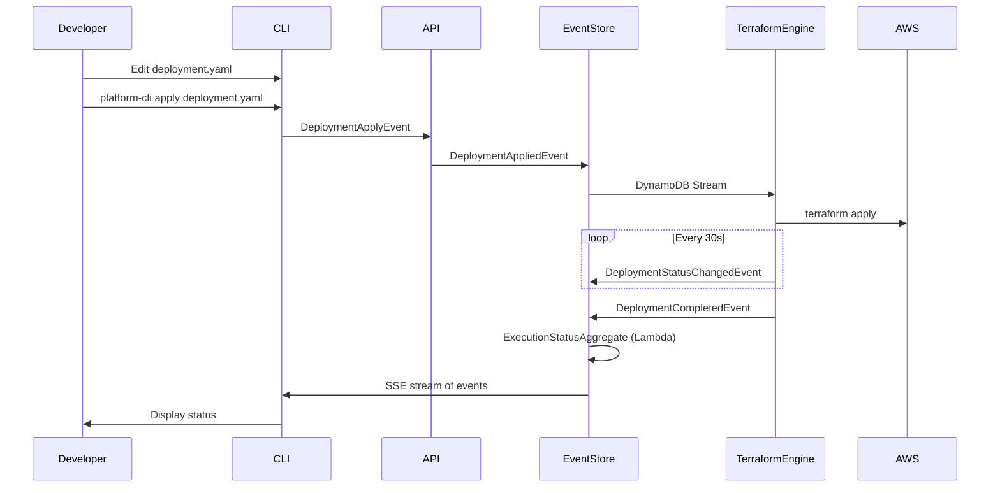
```mermaid
sequenceDiagram
    participant Dev as Developer
    participant CLI
    participant API
    participant EventStore
    participant TerraformEngine
    participant AWS

    Dev->>CLI: Edit deployment.yaml
    Dev->>CLI: platform-cli apply deployment.yaml

    CLI->>API: DeploymentApplyEvent
    API->>EventStore: DeploymentAppliedEvent

    EventStore->>TerraformEngine: DynamoDB Stream
    TerraformEngine->>AWS: terraform apply

    loop Every 30s
        TerraformEngine->>EventStore: DeploymentStatusChangedEvent
    end

    TerraformEngine->>EventStore: DeploymentCompletedEvent
    EventStore->>EventStore: ExecutionStatusAggregate (Lambda)

    EventStore->>CLI: SSE stream of events
    CLI->>Dev: Display status
```

**Benefits Realized:**
- Developers can see deployment history: `platform-cli history deployment prod-app`
- Audit trail for compliance: Who deployed what, when
- Rollback capability: Retrieve previous artifact version and re-apply
- Analytics: Track deployment frequency, success rates, durations

### 12.3 Configuration Management System

**Use Case**: Centralized configuration for microservices across environments

**Domain Objects:**
- `ConfigMap`: Key-value configuration
- `Secret`: Encrypted sensitive configuration
- `ConfigBinding`: Binding of config to application

**Key Features:**
- Configuration versioning: Each change stored as event
- Audit trail: Track who changed which config value
- Temporal queries: "What was the DB password on Jan 1?"
- Safe rollbacks: Revert to previous ConfigAppliedEvent

**Example Query:**

```python
# Get current production DB config
config = get_current_state('CONFIG', 'db-prod', 'app-12345')

# Get config as it was last week
historical_config = get_state_at_time(
    'CONFIG',
    'db-prod',
    'app-12345',
    '2025-01-25T00:00:00Z'
)

# Compare
diff = jsondiff(historical_config, config)
print(f"Changes in last week: {diff}")
```

### 12.4 Multi-Tenant SaaS Platform

**Use Case**: SaaS platform where tenants define custom workflows

**Domain Objects:**
- `Workflow`: Custom workflow definition
- `WorkflowExecution`: Instance of workflow running
- `WorkflowStep`: Individual step in execution

**Benefits:**
- Each tenant's data isolated by `appId` in keys
- New tenants onboarded without schema changes
- Tenant-specific aggregates for usage billing
- Per-tenant audit logs for compliance

**Multi-Tenancy Query:**

```python
# Get all workflow executions for tenant
executions = table.query(
    IndexName='GSI1-EventType',
    KeyConditionExpression="GSI1PK = :type",
    FilterExpression="meta.appId = :tenant_id",
    ExpressionAttributeValues={
        ':type': 'EVENT_TYPE#WorkflowExecutionStartedEvent',
        ':tenant_id': 'tenant-abc-123'
    }
)
```

### 12.5 Artifact Registry Platform

**Use Case**: Internal artifact repository for build artifacts (JARs, containers, Terraform modules)

**Domain Objects:**
- `Artifact`: Metadata about artifact (name, version, location)
- `ArtifactVersion`: Specific version of artifact
- `ArtifactAccess`: Access logs for compliance

**Event Types:**
- `ArtifactPublishedEvent`: New artifact version published
- `ArtifactDownloadedEvent`: Artifact accessed by user/system
- `ArtifactDeprecatedEvent`: Artifact marked deprecated
- `ArtifactDeletedEvent`: Artifact removed

**Aggregate:**
- `ArtifactUsageAggregate`: Download counts, last accessed, top users

**Benefits:**
- Complete audit trail of artifact lifecycle
- Usage analytics for identifying unused artifacts
- Version history for rollback scenarios
- Deprecation tracking and notification

---

## 13. Conclusion

### 13.1 Summary

Domain State Event Logging (DSEL) represents a pragmatic evolution of event-driven persistence patterns, optimized for the unique requirements of platform engineering:

1. **Full-State Capture**: Eliminates replay complexity while maintaining temporal history
2. **Declarative Semantics**: Kubernetes-style API experience for platform users
3. **Multi-Resolution Streams**: Efficient queries at different granularities via aggregates
4. **Query-Stable Evolution**: New domain objects added without impacting existing queries
5. **Multi-Tier Read Architecture**: DAX for microsecond-latency critical reads, DynamoDB for consistency, OpenSearch for search/analytics with graceful fallback
6. **Global Distribution**: DynamoDB Global Tables or Cassandra enable globally consistent platform state across regions, with regional OpenSearch clusters for local-latency search
7. **Integrated Analytics**: Native streaming to OpenSearch, data lakes, and downstream systems

### 13.2 Key Insights

**Insight 1: Storage is Cheap, Complexity is Expensive**

In 2025, storing full state snapshots costs pennies, while debugging event replay logic or maintaining multiple CQRS projections costs engineer-weeks. DSEL optimizes for developer productivity over storage efficiency.

**Insight 2: Events as First-Class Domain Objects**

By treating events as queryable domain objects (not just audit logs), DSEL eliminates the need for separate read models while retaining all the benefits of event-driven architecture.

**Insight 3: Multi-Resolution is Natural**

Just as maps have different zoom levels, event streams naturally have multiple resolutions. DSEL embraces this with aggregate meta-streams rather than fighting it.

**Insight 4: Declarative Intent Matters**

Capturing user intent separately from system outcome provides invaluable debugging and audit capabilities, especially in platforms where users declare desired state.

**Insight 5: Multi-Tier Reads Optimize for Different Latency Requirements**

Not all queries have the same performance requirements. DSEL's multi-tier read architecture (DAX for critical paths, DynamoDB for consistency, OpenSearch for search/analytics) recognizes this reality and provides the right tool for each query type, with graceful degradation ensuring resilience.

**Insight 6: Global Distribution Comes for Free**

By leveraging globally-distributed databases (DynamoDB Global Tables, Cassandra), DSEL achieves globally consistent platform state without additional complexity. Write in one region, read from any region with local latency. Regional OpenSearch clusters provide isolated, scalable search while maintaining the single source of truth in the globally-replicated event store.

### 13.3 Applicability

DSEL is particularly well-suited for:

- **Platform Engineering**: Internal developer platforms, Kubernetes-style systems
- **Global Platforms**: Multi-region platforms requiring consistent state worldwide
- **Configuration Management**: Versioned, auditable configuration systems
- **Deployment Orchestration**: CI/CD pipelines, infrastructure automation
- **Multi-Tenant SaaS**: Isolated tenant data with rapid schema evolution
- **Compliance-Heavy Domains**: Financial services, healthcare, government
- **High-Availability Systems**: Systems requiring regional failover and disaster recovery

It may be over-engineering for:

- Simple CRUD applications
- Systems with stable, unchanging schemas
- High-frequency trading or real-time gaming
- Greenfield projects without evolution requirements

### 13.4 Future Directions

**1. Standardization**

The pattern could benefit from:
- Standard event envelope schemas (OpenTelemetry-style)
- Common aggregate patterns for typical platform scenarios
- Reference implementations in popular languages

**2. Tooling**

Potential tooling improvements:
- Code generators for event schemas from domain models
- Query builders for common DynamoDB access patterns
- Visualization tools for event streams and aggregates
- Migration tools from CRUD databases to DSEL

**3. Extensions**

Interesting extensions to explore:
- **Event Compaction**: Periodic compaction of event history to reduce storage
- **Cross-Region Replication**: DynamoDB Global Tables for multi-region platforms
- **Event Encryption**: Field-level encryption for sensitive domain data
- **Event Schemas as Code**: Versioned event schema definitions with validation

### 13.5 Final Thoughts

Domain State Event Logging emerged from building real production platforms, not from academic theory. It represents a pragmatic synthesis of Event Sourcing, CQRS, Domain-Driven Design, and declarative API patterns—optimized for the realities of modern platform engineering.

The pattern's simplicity is its strength: full-state events, multi-dimensional keys, and optional aggregates. This simplicity enables rapid development, easy debugging, and confident evolution—critical for platforms that must adapt to changing business requirements.

If you're building a platform where schema evolution, audit trails, and temporal queries matter more than storage optimization, consider DSEL. The tradeoff of storage cost for operational simplicity may be the right choice for your system.

---

## Appendices

### Appendix A: Complete DSEL Architecture Diagram

The following diagram illustrates the complete DSEL architecture including write path, multi-tier read path, stream processing, and analytics:

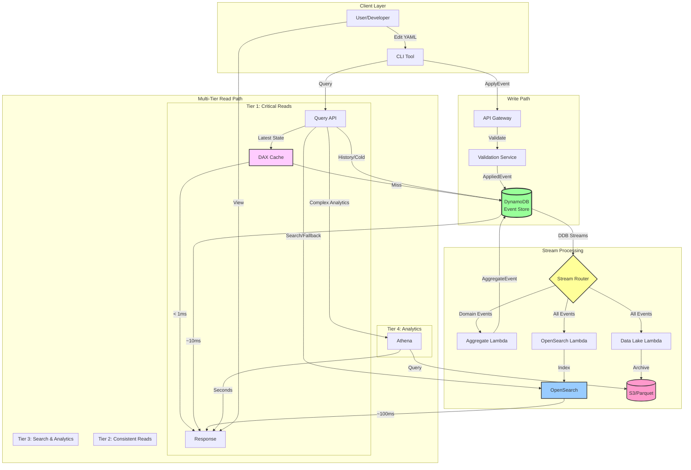
```mermaid
graph TB
    subgraph "Client Layer"
        USER[User/Developer] -->|Edit YAML| CLI[CLI Tool]
    end

    subgraph "Write Path"
        CLI -->|ApplyEvent| API[API Gateway]
        API -->|Validate| VAL[Validation Service]
        VAL -->|AppliedEvent| DDB[(DynamoDB<br/>Event Store)]
    end

    subgraph "Stream Processing"
        DDB -->|DDB Streams| STREAM{Stream Router}
        STREAM -->|Domain Events| AGG[Aggregate Lambda]
        STREAM -->|All Events| OS_LAMBDA[OpenSearch Lambda]
        STREAM -->|All Events| DL_LAMBDA[Data Lake Lambda]

        AGG -->|AggregateEvent| DDB
        OS_LAMBDA -->|Index| OS[OpenSearch]
        DL_LAMBDA -->|Archive| S3[(S3/Parquet)]
    end

    subgraph "Multi-Tier Read Path"
        QUERY[Query API]

        subgraph "Tier 1: Critical Reads"
            QUERY -->|Latest State| DAX[DAX Cache]
            DAX -->|< 1ms| RESP[Response]
            DAX -->|Miss| DDB
        end

        subgraph "Tier 2: Consistent Reads"
            QUERY -->|History/Cold| DDB
            DDB -->|~10ms| RESP
        end

        subgraph "Tier 3: Search & Analytics"
            QUERY -->|Search/Fallback| OS
            OS -->|~100ms| RESP
        end

        subgraph "Tier 4: Analytics"
            QUERY -->|Complex Analytics| ATHENA[Athena]
            ATHENA -->|Query| S3
            ATHENA -->|Seconds| RESP
        end
    end

    CLI -->|Query| QUERY
    USER -->|View| RESP

    style DDB fill:#9f9,stroke:#333,stroke-width:3px
    style DAX fill:#fcf,stroke:#333,stroke-width:2px
    style OS fill:#9cf,stroke:#333,stroke-width:2px
    style S3 fill:#f9c,stroke:#333,stroke-width:2px
    style STREAM fill:#ff9,stroke:#333,stroke-width:2px
```

**Architecture Components:**

1. **Client Layer**: CLI tools for declarative manifest application
2. **Write Path**: API Gateway → Validation → Event Store (DynamoDB)
3. **Stream Processing**: DynamoDB Streams fan-out to aggregates, search indexes, data lakes
4. **Multi-Tier Read Path**:
   - **Tier 1 (DAX)**: Microsecond latency for critical reads
   - **Tier 2 (DynamoDB)**: Millisecond latency for consistent reads
   - **Tier 3 (OpenSearch)**: Sub-second search and analytics
   - **Tier 4 (Data Lake)**: Complex analytics via Athena

**Data Flow:**
- **Write Flow**: User → CLI → API → DynamoDB (AppliedEvent)
- **Stream Flow**: DynamoDB → Streams → Lambdas → OpenSearch/S3/Aggregates
- **Read Flow**: Query API → DAX/DynamoDB/OpenSearch/Athena → Response

### Appendix B: Sample Event Schemas

#### ArtifactAppliedEvent

```yaml
apiVersion: v1alpha1
kind: ArtifactAppliedEvent

meta:
  eventId: evt-550e8400-e29b-41d4-a716-446655440000
  timestamp: 2025-01-15T10:30:00.000Z
  correlationId: req-123e4567-e89b-12d3-a456-426614174000
  executionId: exec-9876-5432-1234
  userId: john.doe@example.com
  name: terraform-vpc-module
  appId: "09287"

spec:
  artifact:
    apiVersion: v1alpha1
    kind: Artifact
    meta:
      name: terraform-vpc-module
      appId: "09287"
      labels:
        team: platform
        environment: production
    spec:
      version: 2.1.0
      regions:
        - us-east-1
        - us-west-2
      bundles:
        - name: vpc-module.zip
          type: terraform
          location: s3://artifacts/vpc-module-2.1.0.zip
          checksum: sha256:abcd1234...

  validation:
    overall: SUCCESS
    details:
      validations:
        - name: naming-convention
          pass: true
        - name: valid-regions
          pass: true
        - name: bundle-accessible
          pass: true

  metadata:
    processingTime: 245ms
    validatorVersion: 1.5.2
```

#### ExecutionStatusAggregate

```yaml
apiVersion: v1alpha1
kind: ExecutionStatusAggregate

meta:
  eventId: agg-770e8400-e29b-41d4-a716-446655440000
  timestamp: 2025-01-15T10:35:00.000Z
  executionId: exec-9876-5432-1234
  name: deployment-prod-vpc
  appId: "09287"

spec:
  summary:
    phase: COMPLETED
    startTime: 2025-01-15T10:30:00Z
    endTime: 2025-01-15T10:35:00Z
    duration: 300s
    status: SUCCESS
    errorCount: 0
    warningCount: 2

  enrichment:
    resourceCount: 42
    awsResources:
      - arn: arn:aws:ec2:us-east-1:123456789012:vpc/vpc-0abcd1234
        type: AWS::EC2::VPC
        status: ACTIVE
        region: us-east-1
      - arn: arn:aws:ec2:us-east-1:123456789012:subnet/subnet-0xyz9876
        type: AWS::EC2::Subnet
        status: ACTIVE
        region: us-east-1
      # ... 40 more resources

    costs:
      estimatedMonthly: 150.00
      currency: USD

  eventStream:
    totalEvents: 47
    firstEventId: evt-001
    lastEventId: evt-047
    eventTypes:
      DeploymentValidatedEvent: 1
      DeploymentAppliedEvent: 1
      DeploymentStatusChangedEvent: 43
      DeploymentCompletedEvent: 1
      DeploymentWarningEvent: 2

  references:
    artifactId: terraform-vpc-module
    artifactVersion: 2.1.0
    configIds:
      - config-prod-vpc-us-east-1
      - config-prod-vpc-us-west-2
    triggeredBy: john.doe@example.com
    approvedBy: jane.smith@example.com
```

### Appendix C: DynamoDB Item Examples

#### Domain Event Item

```json
{
  "PK": "ARTIFACT#terraform-vpc-module#09287",
  "SK": "EVENT#2025-01-15T10:30:00.000Z#evt-550e8400",
  "GSI1PK": "EVENT_TYPE#ArtifactAppliedEvent",
  "GSI1SK": "TIMESTAMP#2025-01-15T10:30:00.000Z",
  "GSI2PK": "EXECUTION#exec-9876-5432-1234",
  "GSI2SK": "TIMESTAMP#2025-01-15T10:30:00.000Z",
  "apiVersion": "v1alpha1",
  "kind": "ArtifactAppliedEvent",
  "meta": {
    "eventId": "evt-550e8400-e29b-41d4-a716-446655440000",
    "timestamp": "2025-01-15T10:30:00.000Z",
    "userId": "john.doe@example.com",
    "name": "terraform-vpc-module",
    "appId": "09287"
  },
  "spec": {
    "artifact": { /* ... */ },
    "validation": { /* ... */ }
  }
}
```

#### Aggregate Event Item

```json
{
  "PK": "AGGREGATE#ExecutionStatusAggregate#exec-9876-5432-1234",
  "SK": "EVENT#2025-01-15T10:35:00.000Z#agg-770e8400",
  "GSI1PK": "EVENT_TYPE#ExecutionStatusAggregate",
  "GSI1SK": "TIMESTAMP#2025-01-15T10:35:00.000Z",
  "GSI2PK": "EXECUTION#exec-9876-5432-1234",
  "GSI2SK": "TIMESTAMP#2025-01-15T10:35:00.000Z",
  "apiVersion": "v1alpha1",
  "kind": "ExecutionStatusAggregate",
  "meta": {
    "eventId": "agg-770e8400-e29b-41d4-a716-446655440000",
    "timestamp": "2025-01-15T10:35:00.000Z",
    "executionId": "exec-9876-5432-1234",
    "name": "deployment-prod-vpc",
    "appId": "09287"
  },
  "spec": {
    "summary": { /* ... */ },
    "enrichment": { /* ... */ },
    "eventStream": { /* ... */ },
    "references": { /* ... */ }
  }
}
```

### Appendix D: References

**Related Patterns:**
1. Event Sourcing (Fowler): https://martinfowler.com/eaaDev/EventSourcing.html
2. CQRS: https://martinfowler.com/bliki/CQRS.html
3. DynamoDB Single Table Design: https://aws.amazon.com/blogs/compute/creating-a-single-table-design-with-amazon-dynamodb/
4. Kubernetes API Conventions: https://github.com/kubernetes/community/blob/master/contributors/devel/sig-architecture/api-conventions.md

**Similar Systems:**
1. Datomic: Temporal database with fact-based storage
2. Event Store: Purpose-built event sourcing database
3. Apache Kafka: Distributed event streaming platform
4. AWS EventBridge: Event bus with archive/replay

**Further Reading:**
1. "Domain-Driven Design" by Eric Evans
2. "Building Microservices" by Sam Newman
3. "Designing Data-Intensive Applications" by Martin Kleppmann

---

**Document Version**: 1.0
**Last Updated**: January 2025
**Author**: Trevor Samaroo
**License**: CC BY 4.0

---

## Acknowledgments

This pattern emerged from building production platforms at scale. Thanks to the platform engineering community for inspiration from Kubernetes, Terraform, and countless internal developer platforms that informed this work.

Special recognition to the AWS DynamoDB team for creating a storage system flexible enough to support novel access patterns like DSEL.

---

*"Simplicity is the ultimate sophistication." - Leonardo da Vinci*

The power of DSEL lies not in its complexity, but in how it makes complex platform engineering problems simple to solve.
